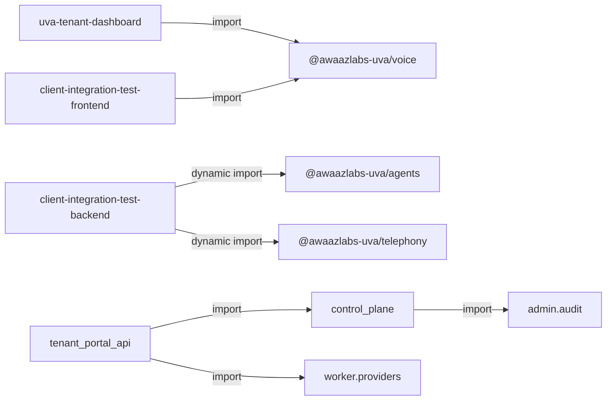

# Structural map

Scope note [VERIFIED]: graphify-out absent at collection time (`graphify-out/`, `graphify-out/graph.json`, `graphify-out/GRAPH_REPORT.md` all missing). Source trees read for published npm packages (`sdk/`, `sdk-server/`, `telephony/`) in full; Python services and host apps sampled via entry modules, greps, and selected construction sites. NOT READ in full: `dashboard/src/**` page/component bodies beyond env/import greps (LOC counted), `worker/main.py` body beyond entry/prewarm, `tenant_portal_api/telephony_service.py` body, `supabase/migrations/**`, `docs/**`, `tests/**` bodies, `self-serve-demo-UI/`, `voice-picker/`, `state/`, `scripts/**` except env/entry greps.

## A. Repo overview

| Fact | Value | Tag | Citation |
|---|---|---|---|
| Monorepo tool | none (no `pnpm-workspace.yaml`, `lerna.json`, `turbo.json`, `nx.json`) | [VERIFIED] | (absence checked at repo root; root `package.json` has no `workspaces` field) `package.json:L1-L5` |
| Root package.json | only `devDependencies.supabase` | [VERIFIED] | `package.json:L1-L5` |
| Lockfiles | root `pnpm-lock.yaml` (lockfileVersion 9) covers root importer only; per-package `package-lock.json` present under `sdk/`, `sdk-server/`, `telephony/`, `dashboard/` | [VERIFIED] | `pnpm-lock.yaml:L1-L14`; presence: `sdk/package-lock.json`, `sdk-server/package-lock.json`, `telephony/package-lock.json`, `dashboard/package-lock.json` |
| Node version (CI) | Node.js 20 | [VERIFIED] | `.github/workflows/ci.yml:L80-L83` |
| Node engines (packages) | `>=20` on telephony, host-tools, client-integration-test/backend, host-backend-starter | [VERIFIED] | `telephony/package.json:L45-L47`; `host-tools/package.json:L12-L14`; `client-integration-test/backend/package.json:L10-L12`; `client-deliverables-final/host-backend-starter/package.json:L11-L13` |
| Python version (CI/Docker) | Python 3.12 (CI); Docker base `python:3.12.14-slim` | [VERIFIED] | `.github/workflows/ci.yml:L18-L21`; `docker/control-plane.Dockerfile:L12`; `docker/worker.Dockerfile:L1` |
| TypeScript (npm pkgs) | `typescript` `^5.4.0` as devDependency | [VERIFIED] | `sdk/package.json:L48-L50`; `sdk-server/package.json:L46-L48`; `telephony/package.json:L48-L50`; `dashboard/package.json:L32-L33` |
| Build tooling (TS SDK pkgs) | `tsc` via `"build": "tsc"`; tsconfig `outDir: dist`, `rootDir: src` | [VERIFIED] | `sdk/package.json:L39-L40`; `sdk/tsconfig.json:L2-L15`; `sdk-server/package.json:L39-L40`; `telephony/package.json:L39-L40` |
| Dashboard build | Next.js (`next build` / `next dev`) | [VERIFIED] | `dashboard/package.json:L5-L8` |
| Python deps / lint | root `requirements.txt`; Makefile `ruff` + `pytest` | [VERIFIED] | `requirements.txt:L1-L34`; `Makefile:L9-L12` |
| Root scripts | root `package.json` has no `scripts`; Makefile targets: `gate`, `test`, `lint`, `secrets`, `db-*`, `bundle-check`, etc. | [VERIFIED] | `package.json:L1-L5`; `Makefile:L1-L38` |
| CI config files | `.github/workflows/ci.yml`, `deploy-prod.yml`, `deploy-staging.yml`, `reconcile.yml`, `purge-session-media.yml`, `refresh-voice-previews.yml`, `release-sdk.yml` | [VERIFIED] | paths under `.github/workflows/` (listed via directory listing); `ci.yml:L1-L8`; `release-sdk.yml:L1-L11` |

## B. Package table

LOC = physical lines in non-test source files (PowerShell count; excludes `node_modules`, `dist`, `*.test.*`, `test/` / `tests/`).

| name | version | path | one-line purpose (from code) | public/private | entry points | src LOC | # src files | # test files | runtime deps | peerDeps |
|---|---|---|---|---|---|---|---|---|---|---|
| `@awaazlabs-uva/voice` | `1.1.0` | `sdk/` | Browser LiveKit voice client: session mint/refresh, room connect, transcripts/events | public (`publishConfig.access: public`) | `main`/`types`/`exports["."]` → `dist/index.js` / `.d.ts`; no `bin` | 921 | 4 | 4 | `livekit-client ^2.0.0` | none (field absent) |
| `@awaazlabs-uva/agents` | `0.1.0` | `sdk-server/` | Server HMAC client for `/machine/agents` + provider capabilities + number assign | public | `main`/`types`/`exports["."]` → `dist/index.js`; no `bin` | 313 | 1 | 1 | `{}` (empty) | none |
| `@awaazlabs-uva/telephony` | `0.1.0` | `telephony/` | Backend HMAC client for `/machine/telephony/*` Telnyx ops | public | `main`/`types`/`exports["."]` → `dist/index.js`; no `bin`; `engines.node >=20` | 886 | 7 | 2 | none listed | none |
| `uva-tenant-dashboard` | `1.0.0` | `dashboard/` | Next.js tenant console (agents, credentials, test studio, telephony UI) | private | Next scripts `dev`/`build`/`start`; no `main`/`exports`/`bin` | 8802 | 73 | 0 | see `dashboard/package.json` deps incl. `file:../sdk` voice, Next, Supabase | none |
| `awaazlabs-uva-host-tools` | `1.0.0` | `host-tools/` | Express tool-gateway for worker book/reschedule/cancel | private | `start` → `node src/server.js`; no `main`/`exports`/`bin` | 364 | 3 | 1 | `dotenv`, `express` | none |
| `client-integration-test` | `1.0.0` | `client-integration-test/` | Meta package scripting backend+frontend smoke install/dev | private | scripts only | 0 (no src) | 0 | 0 | none | none |
| `client-integration-test-frontend` | `1.0.0` | `client-integration-test/frontend/` | Vite UI integrating `@awaazlabs-uva/voice` | private | `vite` scripts; no `main`/`exports`/`bin` | 1601 | 3 | 0 | `@awaazlabs-uva/voice 1.1.0` | none |
| `client-integration-test-backend` | `1.0.0` | `client-integration-test/backend/` | Express host minting sessions + agents/telephony demos | private | `node src/server.js` | 924 | 5 | 0 | agents, telephony, dotenv, express | none |
| `awaazlabs-uva-host-backend-starter` | `1.0.0` | `client-deliverables-final/host-backend-starter/` | Minimal Express session mint/refresh starter | private | `node src/server.js` | 286 | 4 | 0 | dotenv, express | none |
| (Python) `control_plane` | NOT FOUND (no package version file; searched: `control_plane/pyproject.toml`, `setup.py`) | `control_plane/` | FastAPI LiveKit session mint/refresh | N/A (service module) | Docker: `uvicorn control_plane.app:app` | 2167 | 11 | 0 (under package) | via root `requirements.txt` | N/A |
| (Python) `worker` | NOT FOUND (no version file) | `worker/` | LiveKit agents worker (STT/LLM/TTS session runtime) | N/A | Docker: `python -m worker.main start` | 10476 | 63 | 0 | via `requirements.txt` (livekit-agents, plugins, …) | N/A |
| (Python) `tenant_portal_api` | NOT FOUND | `tenant_portal_api/` | FastAPI tenant portal + machine HMAC + Telnyx webhooks | N/A | Docker: `uvicorn tenant_portal_api.app:app` | 12272 | 31 | 1 | via `requirements.txt` | N/A |
| (Python) `admin` | NOT FOUND | `admin/` | FastAPI super-admin portal | N/A | Docker: `uvicorn admin.app:app --port 8001` | 1117 | 6 | 0 | via `requirements.txt` | N/A |
| (Python) `services` | NOT FOUND (searched: `services/pyproject.toml`, `setup.py`) | `services/` | Package marker + `tts_cache.py` module | N/A | no Docker CMD entry in `docker/*.Dockerfile` (searched CMD lines) | 63 | 2 | 0 | via `requirements.txt` | N/A |

Citations for table cells:

- voice name/version/public/entry/deps: `sdk/package.json:L2-L51`
- agents: `sdk-server/package.json:L2-L49`
- telephony: `telephony/package.json:L2-L50`
- dashboard: `dashboard/package.json:L2-L38`
- host-tools: `host-tools/package.json:L2-L18`
- client-integration-test: `client-integration-test/package.json:L2-L11`
- frontend: `client-integration-test/frontend/package.json:L2-L17`
- backend: `client-integration-test/backend/package.json:L2-L18`
- host-backend-starter: `client-deliverables-final/host-backend-starter/package.json:L2-L18`
- voice purpose: `sdk/src/index.ts:L151-L352` (`AwaazLabsUvaVoice.connect`)
- agents purpose: `sdk-server/src/index.ts:L1-L9`, `L184-L212`
- telephony purpose: `telephony/src/index.ts:L58-L80`, `telephony/package.json:L4`
- host-tools purpose: `host-tools/package.json:L6`; `host-tools/src/createApp.js:L37-L72`
- control_plane purpose/entry: `control_plane/app.py:L1-L7`; `docker/control-plane.Dockerfile:L41`
- worker purpose/entry: `worker/main.py:L1575-L1621`; `docker/worker.Dockerfile:L45`
- tenant_portal purpose/entry: `tenant_portal_api/app.py:L1-L7`; `docker/tenant-portal-api.Dockerfile:L35`
- admin purpose/entry: `admin/app.py:L1-L4`; `docker/admin.Dockerfile:L45`
- services purpose: `services/__init__.py:L1`; `services/tts_cache.py:L1-L15`
- LOC/file counts [VERIFIED]: `sdk/src` 4 files / 921 lines (`sdk/src/index.ts` 744 + `sdk/src/internal/errors.ts` 88 + `sdk/src/internal/http.ts` 32 + `sdk/src/internal/livekitToken.ts` 57); `telephony/src` 7 files / 886 lines; `sdk-server/src/index.ts` 313 lines; other package LOC from the same line-count pass over the trees named in section B

## C. Inter-package dependency graph

### Verified import edges (code imports, not package.json alone)

| From | Imports | How | Citation |
|---|---|---|---|
| `uva-tenant-dashboard` | `@awaazlabs-uva/voice` | static import in Test Studio | `dashboard/src/app/test-studio/page.tsx:L6` |
| `uva-tenant-dashboard` | `@awaazlabs-uva/voice` | `package.json` `file:../sdk` | `dashboard/package.json:L12-L13` |
| `client-integration-test-frontend` | `@awaazlabs-uva/voice` | static import | `client-integration-test/frontend/src/main.ts:L6` |
| `client-integration-test-backend` | `@awaazlabs-uva/agents` | dynamic `import('@awaazlabs-uva/agents')` | `client-integration-test/backend/src/createApp.js:L68-L73` |
| `client-integration-test-backend` | `@awaazlabs-uva/telephony` | dynamic `import('@awaazlabs-uva/telephony')` | `client-integration-test/backend/src/telephonyRoutes.js:L27-L32` |
| `tenant_portal_api` | `control_plane.*` | multiple Python imports | `tenant_portal_api/app.py:L53-L61`; `tenant_portal_api/jwt_secret.py:L27-L30`; `tenant_portal_api/machine_auth.py:L34-L35` |
| `tenant_portal_api` | `worker.providers.*` | capabilities/validation | `tenant_portal_api/provider_capabilities.py:L22`; `tenant_portal_api/provider_validation.py:L23-L38` |
| `control_plane` | `admin.audit` | `record_mint_rejection` | `control_plane/app.py:L58` |

Published SDK packages have no inter-SDK dependency entries [VERIFIED]:

- `@awaazlabs-uva/voice` dependencies only `livekit-client` — `sdk/package.json:L45-L47`
- `@awaazlabs-uva/agents` dependencies `{}` — `sdk-server/package.json:L45`
- `@awaazlabs-uva/telephony` no `dependencies` key — `telephony/package.json:L45-L50`

Docs markdown strings inside dashboard contain example import lines for agents/telephony/voice; those are string content, not runtime imports [VERIFIED] `dashboard/src/content/docs/pages/quickstart.ts:L8-L44` (`export const markdown = \``).

### Mermaid (verified edges)

Edges below restate the citation table in section C (same import sites: `dashboard/src/app/test-studio/page.tsx:L6`, `client-integration-test/frontend/src/main.ts:L6`, `client-integration-test/backend/src/createApp.js:L68-L73`, `client-integration-test/backend/src/telephonyRoutes.js:L27-L32`, `tenant_portal_api/app.py:L53-L61`, `tenant_portal_api/provider_capabilities.py:L22`, `control_plane/app.py:L58`).

### Circular deps

NOT FOUND among published npm packages (searched: `@awaazlabs-uva/*` imports in `*.{ts,tsx,js,mjs}` and `dependencies` in `sdk/package.json:L45-L47`, `sdk-server/package.json:L45`, `telephony/package.json:L45-L50`).

Python edge note [VERIFIED]: `tenant_portal_api` → `control_plane` (`tenant_portal_api/app.py:L53-L61`) and `control_plane` → `admin.audit` (`control_plane/app.py:L58`) form a one-way chain. No `control_plane` → `tenant_portal_api` import found (searched `control_plane/*.py` for `tenant_portal`).

### Deep imports / public-API bypass

| Observation | Tag | Citation |
|---|---|---|
| `require('@awaazlabs-uva/voice/package.json')` in Vite config (subpath outside package `exports["."]`) | [VERIFIED] | `client-integration-test/frontend/vite.config.ts:L8`; package exports only `"."` at `sdk/package.json:L27-L33` |
| Voice package keeps helpers under `src/internal/` with comment that they are not package `exports` | [VERIFIED] | `sdk/src/internal/http.ts:L1-L3`; `sdk/src/internal/errors.ts:L1-L3` |
| Telephony `transport.ts` / `errors.ts` helpers are module-level exports but not re-exported from `telephony/src/index.ts` (package `exports` only `"."` → index) | [VERIFIED] | `telephony/package.json:L27-L33`; `telephony/src/index.ts:L45-L56` vs `telephony/src/transport.ts:L31-L111` |

## D. Public API surface (per package)

Public = re-exported through package `exports["."]` entry (`dist/index.js`). Documented? = JSDoc/block comment on symbol (yes/no) and README present for package (yes/no). Marked experimental/internal? = no `@experimental` / `@internal` / `@deprecated` tags found in these sources [VERIFIED] (grep over `sdk/src`, `telephony/src`, `sdk-server/src`).

### `@awaazlabs-uva/voice` (`sdk/src/index.ts` + re-exports)

| name | kind | signature / shape | file:line | documented? | experimental/internal? |
|---|---|---|---|---|---|
| `AwaazLabsUvaVoiceErrorCode` | type | union of error code strings | `sdk/src/internal/errors.ts:L18-L26` (re-export `sdk/src/index.ts:L21`) | yes (JSDoc on type `sdk/src/internal/errors.ts:L6-L17`); README yes (`sdk/README.md` exists) | no |
| `AwaazLabsUvaVoiceError` | class | `constructor(code, message?)` | `sdk/src/internal/errors.ts:L28-L36`; export `sdk/src/index.ts:L22` | yes (class name/docs in errors file); README yes | no |
| `UvaError` | class alias | `AwaazLabsUvaVoiceError as UvaError` | `sdk/src/index.ts:L23` | no dedicated JSDoc on alias | no |
| `UvaErrorCode` | type alias | `= AwaazLabsUvaVoiceErrorCode` | `sdk/src/index.ts:L24` | no | no |
| `AwaazLabsUvaVoiceOptions` | interface | `publishableKey`, `sessionEndpoint`, optional refresh/headers/credentials/timeout | `sdk/src/index.ts:L26-L48` | yes (field JSDoc) | no |
| `UrduVoiceAgentOptions` | type alias | `= AwaazLabsUvaVoiceOptions` | `sdk/src/index.ts:L50` | no | no |
| `ConnectOptions` | interface | `{ agentId; voiceId? }` | `sdk/src/index.ts:L52-L55` | no | no |
| `ConnectTiming` | interface | `{ mintMs; livekitConnectMs; livekitUrlHost?; connectionQuality? }` | `sdk/src/index.ts:L58-L65` | yes | no |
| `Voice` | interface | voice catalog row | `sdk/src/index.ts:L67-L74` | no | no |
| `ConnectionState` | type | `'idle' \| 'connecting' \| 'connected' \| 'disconnecting'` | `sdk/src/index.ts:L77` | no | no |
| `AwaazLabsUvaVoiceEvent` | type | event name union | `sdk/src/index.ts:L79-L90` | no | no |
| `UvaEvent` | type alias | `= AwaazLabsUvaVoiceEvent` | `sdk/src/index.ts:L92` | no | no |
| `TranscriptEvent` | interface | `{ id; text; final; speaker }` | `sdk/src/index.ts:L94-L102` | yes | no |
| `MetricsEvent` | interface | `{ type; [key: string]: unknown }` | `sdk/src/index.ts:L104-L107` | no | no |
| `AwaazLabsUvaVoiceEventMap` | interface | typed event args map | `sdk/src/index.ts:L117-L136` | yes (partial field JSDoc) | no |
| `UvaEventMap` | type alias | `= AwaazLabsUvaVoiceEventMap` | `sdk/src/index.ts:L138` | no | no |
| `AwaazLabsUvaVoice` | class | `listVoices`, `constructor`, `connect`, `disconnect`, `on`/`off`, mic/audio APIs | `sdk/src/index.ts:L151-L742` | yes (class/method JSDoc) | no |
| `UrduVoiceAgent` | class alias | `AwaazLabsUvaVoice as UrduVoiceAgent` | `sdk/src/index.ts:L744` | no | no |

Internal (not in package exports): `fetchWithTimeout`, `mapSessionHttpError`, `applyRefreshedLiveKitToken`, etc. [VERIFIED] `sdk/package.json:L27-L33`; modules under `sdk/src/internal/`.

### `@awaazlabs-uva/agents` (`sdk-server/src/index.ts`)

| name | kind | signature / shape | file:line | documented? | experimental/internal? |
|---|---|---|---|---|---|
| `AwaazLabsUvaAgentsClientOptions` | interface | `{ tenantId; tenantSecret; baseUrl; extraHeaders? }` | `sdk-server/src/index.ts:L13-L22` | yes (field JSDoc) | no (file header warns SERVER-SIDE ONLY `L1-L9`) |
| `UvaAgentsClientOptions` | type alias | `= AwaazLabsUvaAgentsClientOptions` | `sdk-server/src/index.ts:L24` | no | no |
| `FirstSpeaker` | type | `'agent' \| 'user'` | `sdk-server/src/index.ts:L26` | no | no |
| `AgentRecord` | interface | agent row fields | `sdk-server/src/index.ts:L28-L52` | yes (partial) | no |
| `CreateAgentParams` | interface | create body (camelCase) | `sdk-server/src/index.ts:L54-L82` | yes | no |
| `UpdateAgentParams` | interface | patch body | `sdk-server/src/index.ts:L84-L103` | yes | no |
| `ProviderCapabilityEntry` | interface | capability cell | `sdk-server/src/index.ts:L110-L116` | yes (block above `L105-L109`) | no |
| `LanguageCapabilities` | interface | per-language STT/LLM/TTS maps | `sdk-server/src/index.ts:L118-L123` | no | no |
| `ProviderCapabilities` | interface | `{ languages }` | `sdk-server/src/index.ts:L125-L127` | no | no |
| `ManagedNumberRecord` | interface | managed number row | `sdk-server/src/index.ts:L129-L141` | no | no |
| `AwaazLabsUvaAgentsError` | class | `(status, message, code?)` | `sdk-server/src/index.ts:L143-L156` | yes | no |
| `UvaAgentsError` | class alias | | `sdk-server/src/index.ts:L158` | no | no |
| `AwaazLabsUvaAgentsClient` | class | `createAgent`, `listAgents`, `updateAgent`, `getProviderCapabilities`, `listManagedNumbers`, `assignAgentToNumber`, `unassignAgentFromNumber` | `sdk-server/src/index.ts:L184-L311` | yes | no |
| `UvaAgentsClient` | class alias | | `sdk-server/src/index.ts:L313` | no | no |

README present: `sdk-server/README.md` exists [VERIFIED].

### `@awaazlabs-uva/telephony` (re-exports from `telephony/src/index.ts`)

| name | kind | signature / shape | file:line | documented? | experimental/internal? |
|---|---|---|---|---|---|
| `AwaazLabsUvaTelephonyError` | class | `(status, code, message, detail?)` | `telephony/src/errors.ts:L15-L32`; export `telephony/src/index.ts:L45` | no JSDoc on class | no |
| `TELEPHONY_MACHINE_OPERATIONS` | const | map of operation → `{method,path,action}` | `telephony/src/routes.ts:L3-L32`; export `telephony/src/index.ts:L46` | no | no |
| `AUTH_HEADER_NAMES` | const | readonly header name tuple | `telephony/src/signing.ts:L5-L10`; export `telephony/src/index.ts:L47-L49` | no | no |
| `canonicalJson` | function | `(value?) => string` | `telephony/src/signing.ts:L36-L39` | no | no |
| `createNonce` | function | `() => string` | `telephony/src/signing.ts:L75-L77` | no | no |
| `createPayloadHash` | function | `(body?) => string` | `telephony/src/signing.ts:L41-L43` | no | no |
| `createRequestSignature` | function | HMAC over tenant/ts/nonce/action/hash | `telephony/src/signing.ts:L45-L56` | no | no |
| `createSignedHeaders` | function | builds auth headers | `telephony/src/signing.ts:L58-L73` | no | no |
| `OperationName` | type | keyof operations map | `telephony/src/routes.ts:L34`; export `telephony/src/index.ts:L55` | no | no |
| `TelephonyClient` | class | Telnyx/machine API methods listed in class body | `telephony/src/index.ts:L58-L253` | no class-level JSDoc | no |
| `export type * from './types.js'` | types | all types in `types.ts` (Json*, HttpMethod, TelephonyFetch*, TelephonyClientOptions, MachineOperation, TelephonyErrorCode, *Params, *Response) | `telephony/src/index.ts:L56`; definitions `telephony/src/types.ts:L1-L215` | mostly no JSDoc | no |

README present: `telephony/README.md` exists [VERIFIED].

Private packages (`dashboard`, `host-tools`, starters) expose no npm `exports` field [VERIFIED] (see B).

## E. External services and vendors

| Service / SDK | Package(s) using it | Client construction site | Config / env | Swappable vs hard-wired | Citation |
|---|---|---|---|---|---|
| LiveKit (WebRTC rooms / tokens) | `@awaazlabs-uva/voice` | `new Room(...)` + `room.connect(wsUrl, token)` | session endpoint returns `token`/`wsUrl`; no LiveKit API keys in browser SDK | hard-wired to `livekit-client` import | `sdk/src/index.ts:L1`; `sdk/src/index.ts:L250-L306`; `sdk/package.json:L45-L47` |
| LiveKit API (AccessToken mint) | `control_plane` | `api.AccessToken(...).to_jwt()` | `LIVEKIT_URL`, `LIVEKIT_API_KEY`, `LIVEKIT_API_SECRET` | hard-wired `livekit.api` | `control_plane/mint.py:L23`; `control_plane/mint.py:L206-L217`; `control_plane/app.py:L65-L67` |
| LiveKit agents runtime | `worker` | `cli.run_app(WorkerOptions(...))` | `LIVEKIT_*`, `LIVEKIT_AGENT_NAME`, idle-process envs | hard-wired `livekit.agents` | `worker/main.py:L1612-L1628` |
| LiveKit SIP API | `tenant_portal_api` | `LiveKitSipClient` → `lk.LiveKitAPI(...)` | `LIVEKIT_URL/API_KEY/API_SECRET`, `LIVEKIT_SIP_URI`, `LIVEKIT_AGENT_NAME` | ctor args override env; mock when `TELEPHONY_PROVIDER_MODE` mock | `tenant_portal_api/livekit_sip.py:L27-L59`; `tenant_portal_api/telephony_config.py:L14-L37` |
| Telnyx REST API | `tenant_portal_api` | `TelnyxClient` + `httpx.Client`; base `https://api.telnyx.com/v2` | tenant-stored API key; `TELNYX_PUBLIC_KEY`; `TELEPHONY_PROVIDER_MODE` | mock mode via config | `tenant_portal_api/telnyx_client.py:L24`; `tenant_portal_api/telnyx_client.py:L177-L190`; `tenant_portal_api/telephony_config.py:L14` |
| Telnyx webhooks | `tenant_portal_api` | FastAPI route verifies Ed25519 signature | `TELNYX_PUBLIC_KEY` | hard-wired route `/webhooks/telephony/telnyx` | `tenant_portal_api/telephony_webhooks.py:L143-L189`; `tenant_portal_api/telephony_webhooks.py:L363-L369`; `tenant_portal_api/telephony_config.py:L26-L27` |
| Deepgram STT | `worker` | `livekit.plugins.deepgram` in `build()` | `DEEPGRAM_API_KEY` (plugin docstring); agent `stt_provider` | registry-swappable (gladia/deepgram) | `worker/providers/stt/deepgram.py:L14-L31`; `worker/providers/registry.py:L32-L43` |
| Gladia STT | `worker` | gladia adapter via registry | `GLADIA_API_KEY` listed in `.env.example` | registry-swappable | `worker/providers/registry.py:L32-L38`; `.env.example:L14` |
| Soniox STT | `worker` (legacy factory path) | `factories.make_stt` branch | `STT_PROVIDER=soniox` | in factory; not in `registry` STT branches | `worker/factories.py:L28-L40`; `worker/providers/registry.py:L32-L43` |
| Gemini LLM | `worker` | `livekit.plugins.google` + `google.genai.types` | `GOOGLE_API_KEY`; `GEMINI_LLM_MODEL`; `GEMINI_THINKING_LEVEL` | registry-swappable vs groq | `worker/providers/llm/gemini.py:L30-L45`; `worker/providers/llm/gemini.py:L64-L69`; `worker/providers/registry.py:L46-L55` |
| Groq LLM | `worker` | `livekit.plugins.groq` | `GROQ_API_KEY`; `GROQ_LLM_MODEL`; `GROQ_MAX_COMPLETION_TOKENS` | registry-swappable | `worker/providers/llm/groq.py:L19-L21`; `worker/providers/llm/groq.py:L41`; `worker/providers/llm/groq.py:L77-L78`; `worker/providers/registry.py:L51-L54` |
| Uplift TTS | `worker` | uplift adapter / prewarm import | `UPLIFTAI_API_KEY`; `UPLIFT_MODE` | registry-swappable | `worker/providers/tts/uplift.py:L66`; `worker/providers/registry.py:L58-L62`; `.env.example:L13` |
| Cartesia TTS | `worker` | `livekit.plugins.cartesia` | `CARTESIA_API_KEY`; `CARTESIA_TTS_MODEL` | registry-swappable | `worker/providers/tts/cartesia.py:L24`; `worker/providers/tts/cartesia_options.py:L191`; `worker/providers/registry.py:L63-L66` |
| ElevenLabs TTS | `worker` | `livekit.plugins.elevenlabs` | `ELEVEN_API_KEY` | registry-swappable | `worker/providers/tts/elevenlabs.py:L23`; `.env.example:L19`; `worker/providers/registry.py:L67-L70` |
| Rime TTS | `worker` | `livekit.plugins.rime` | `RIME_API_KEY` | registry-swappable | `worker/main.py:L1513`; `worker/providers/registry.py:L71-L79`; `.env.example:L21` |
| Fish Audio TTS | `worker` | `fish_audio.build` → `livekit.plugins.fishaudio` | `FISH_API_KEY` | adapter file present; not in `registry._build_tts` | `worker/providers/tts/fish_audio.py:L6-L24`; `worker/providers/registry.py:L58-L80` |
| Silero VAD | `worker` | `livekit.plugins.silero` | (plugin import sites) | hard-wired import in worker | `worker/main.py:L205`; `worker/main.py:L1472` |
| Postgres / Supabase DB | `control_plane`, `worker`, `tenant_portal_api`, `admin` | `psycopg.connect` / pools | `SUPABASE_DB_URL` | hard-wired psycopg | `control_plane/app.py:L84`; `worker/main.py:L189`; `requirements.txt:L24-L25` |
| Supabase JS Auth (browser) | `dashboard` | `createClient(url, anonKey)` | `NEXT_PUBLIC_SUPABASE_URL`, `NEXT_PUBLIC_SUPABASE_ANON_KEY` | hard-wired `@supabase/supabase-js` | `dashboard/src/lib/supabaseBrowser.ts:L1-L26` |
| Supabase Admin / Storage | `tenant_portal_api`, `worker` | service-role helpers | `SUPABASE_URL`, `SUPABASE_SERVICE_ROLE` | hard-wired env client helpers | `tenant_portal_api/supabase_admin.py:L17-L24`; `worker/session_recording.py:L29-L30` |
| Sentry | `control_plane` | `sentry_sdk.init(dsn=...)` when DSN set | `SENTRY_DSN`, `ENVIRONMENT` | optional (skipped if unset) | `control_plane/app.py:L130-L137` |
| Host HTTP session API | voice SDK consumers | `fetch` to host `sessionEndpoint` | host-defined; options in voice SDK | URL via `AwaazLabsUvaVoiceOptions` | `sdk/src/index.ts:L26-L31`; `sdk/src/index.ts:L266-L279` |
| Tool gateway (client backend) | `worker`, `host-tools` | worker POSTs; host-tools Express `/api/tools` | `UVA_TOOLS_BASE_URL`, `TOOL_GATEWAY_SECRET`; per-agent tools fields | URL/secret configurable | `worker/tools.py:L145-L150`; `host-tools/src/server.js:L4-L15`; `sdk-server/src/index.ts:L74-L81` |

Root Python pin list for LiveKit plugins etc.: `requirements.txt:L7-L20`.

## F. Runtime entry points

| type | package | file:line | what triggers it | what it calls next |
|---|---|---|---|---|
| HTTP server (FastAPI/uvicorn) | `control_plane` | `docker/control-plane.Dockerfile:L41`; app `control_plane/app.py:L168` | process start / Docker CMD | routes `/healthz*`, `/v1/voices`, `/v1/session`, `/v1/session/refresh`, optional `/v1/session/dev-mint` (`control_plane/app.py:L196-L1084`) |
| HTTP server (FastAPI/uvicorn) | `tenant_portal_api` | `docker/tenant-portal-api.Dockerfile:L35`; `tenant_portal_api/app.py:L94` | process start | portal + machine routes; includes telephony + webhook routers (`tenant_portal_api/app.py:L424-L1258`) |
| HTTP webhook | `tenant_portal_api` | `tenant_portal_api/telephony_webhooks.py:L363-L369` | Telnyx POST `/webhooks/telephony/telnyx` | signature verify → persist → side effects |
| HTTP server (FastAPI/uvicorn) | `admin` | `docker/admin.Dockerfile:L45`; `admin/app.py:L112` | process start | `/admin/*` routes (`admin/app.py:L140-L392`) |
| LiveKit agent worker | `worker` | `worker/main.py:L1575-L1628`; Docker `docker/worker.Dockerfile:L45` | `python -m worker.main start\|dev` | `prewarm` → optional health HTTP → `cli.run_app(WorkerOptions(entrypoint_fnc=entrypoint,...))` |
| Optional HTTP health | `worker` | `worker/health_http.py` (started from `worker/main.py:L1607-L1610`) | `UVA_WORKER_HEALTH_PORT` > 0 | serves healthz when configured |
| Express listen | `host-tools` | `host-tools/src/server.js:L12-L15` | `npm start` / `node src/server.js` | `createApp` routes `/healthz`, `/api/tools/*` (`host-tools/src/createApp.js:L42-L219`) |
| Express listen | `client-integration-test-backend` | `client-integration-test/backend/src/server.js:L7` | `npm run dev/start` | session/agents/telephony routes in `createApp.js` (`L276+`) |
| Express listen | `host-backend-starter` | `client-deliverables-final/host-backend-starter/src/server.js:L7` | `npm start` | `/api/voice/session` (+ refresh) in `createApp.js:L80-L147` |
| Next.js app | `dashboard` | `dashboard/package.json:L6-L8` | `next dev` / `next start` | App Router pages under `dashboard/src/app/**/page.tsx` |
| Vite dev server | `client-integration-test-frontend` | `client-integration-test/frontend/package.json:L7` | `vite --port 5174` | `src/main.ts` |
| Browser SDK connect | `@awaazlabs-uva/voice` | `sdk/src/index.ts:L240-L352` | host app calls `connect()` | POST sessionEndpoint → LiveKit `room.connect` → event wiring |
| CI cron/workflows | repo | `.github/workflows/reconcile.yml`, `purge-session-media.yml`, `refresh-voice-previews.yml` | GitHub Actions schedules/triggers | invoke `scripts/reconcile_*.py`, purge, preview scripts (workflow files present) |
| npm publish workflow | repo | `.github/workflows/release-sdk.yml:L1-L25` | git tags `voice-v*` / `agents-v*` / `telephony-v*` | publish packages to npm |

Room event listeners (SDK, not a server): `wireRoomEvents` registers LiveKit `RoomEvent.*` handlers [VERIFIED] `sdk/src/index.ts:L423-L523`.

## G. Config and environment variables

Table covers vars with verified `os.getenv` / `os.environ` / `process.env` reads in runtime packages. Defaults shown as coded. Secret? = credential/key material by name/use.

| name | read in (file:line) | default | required/optional | validated? | secret? |
|---|---|---|---|---|---|
| `LIVEKIT_URL` | `control_plane/app.py:L65`; `tenant_portal_api/livekit_sip.py:L37`; `worker/health_http.py:L62`; `worker/stale_jobs.py:L184` | `""` | required for mint/SIP/worker readiness paths | presence checks in health | no |
| `LIVEKIT_API_KEY` | `control_plane/app.py:L66`; `livekit_sip.py:L38`; `health_http.py:L63`; `stale_jobs.py:L185` | `""` | required for LiveKit API | presence checks | yes |
| `LIVEKIT_API_SECRET` | `control_plane/app.py:L67`; `livekit_sip.py:L39`; `health_http.py:L64`; `stale_jobs.py:L186` | `""` | required | presence checks | yes |
| `LIVEKIT_AGENT_NAME` | `control_plane/app.py:L68`; `telephony_config.py:L37`; `worker/main.py:L1585` | `"uva-dev-agent"` | optional (defaulted) | strip/fallback | no |
| `LIVEKIT_NUM_IDLE_PROCESSES` | `worker/main.py:L1625` | `"3"` | optional | `int` + `max(1, …)` | no |
| `LIVEKIT_INITIALIZE_PROCESS_TIMEOUT` | `worker/main.py:L1627` | `"60"` | optional | `float()` | no |
| `LIVEKIT_SIP_URI` | `tenant_portal_api/telephony_config.py:L32` | `""` | optional | strip | no |
| `SUPABASE_DB_URL` | `control_plane/app.py:L84` (+ scripts/dbconn pattern) | from env / `.env.local` | required for DB-backed services | connection use | yes |
| `SUPABASE_URL` | `tenant_portal_api/supabase_admin.py:L17`; `recording_urls.py:L24`; `worker/session_recording.py:L29` | `""` | required for admin/storage features | strip/empty check | yes |
| `SUPABASE_SERVICE_ROLE` | `supabase_admin.py:L24`; `recording_urls.py:L25`; `session_recording.py:L30` | `""` | required for those features | strip | yes |
| `SUPABASE_JWT_SECRET` | `tenant_portal_api/supabase_auth.py:L32` | `""` | required for token verify path | strip | yes |
| `NEXT_PUBLIC_SUPABASE_URL` | `dashboard/src/lib/supabaseBrowser.ts:L10` | none | required (throws if missing) | throws Error if unset | no (public) |
| `NEXT_PUBLIC_SUPABASE_ANON_KEY` | `dashboard/src/lib/supabaseBrowser.ts:L11` | none | required (throws) | throws | no (public anon) |
| `NEXT_PUBLIC_TENANT_PORTAL_API_URL` | `dashboard/src/lib/portalApi.ts:L8`; `portalAuth.ts:L3`; `telephonyApi.ts:L3`; `test-studio/page.tsx:L13`; `next.config.js:L11` | `http://localhost:8002` in next.config | required for portal client helpers (throws in lib) | throws in portalApi/portalAuth | no |
| `NEXT_PUBLIC_CONTROL_PLANE_URL` | `dashboard/src/lib/voicesApi.ts:L1`; `next.config.js:L9` | `http://localhost:8000` in next.config | required for voicesApi (throws) | throws | no |
| `NEXT_PUBLIC_LIVEKIT_URL` | `dashboard/next.config.js:L13` | `'wss://*.livekit.cloud'` | optional (CSP allowlist) | used in config string | no |
| `CP_ALLOWED_ORIGINS` | `control_plane/app.py:L100` | empty → local defaults | required when hosted (comments/guards) | CORS parsing | no |
| `CP_TENANT_SECRETS` | `control_plane/secrets.py:L46-L47` | `""` | local mint map | JSON env provider | yes |
| `CP_DB_SECRET_CACHE_TTL_SEC` | `control_plane/secrets_db.py:L45` | `"60"` | optional | `int` | no |
| `CP_ENABLE_DOCS` | `control_plane/app.py:L149` | off on hosted | optional | truthy set | no |
| `CP_ENABLE_DEV_MINT` | `control_plane/app.py:L1025` | unset/off | optional | truthy set | no |
| `CP_DEV_MINT_RESET_QUOTA` | `control_plane/app.py:L1037` | unset/off | optional | truthy set | no |
| `SENTRY_DSN` | `control_plane/app.py:L130` | `""` | optional | init if set | yes |
| `ENVIRONMENT` | `control_plane/app.py:L136` | `"production"` | optional | passed to Sentry | no |
| `TENANT_PORTAL_JWT_SECRET` | `tenant_portal_api/jwt_secret.py:L32`; `L55` | generated locally if missing; fail if hosted | required hosted | `require_hosted_config` when hosted | yes |
| `TENANT_PORTAL_ORIGINS` | `tenant_portal_api/app.py:L74-L80` | `DEFAULT_PORTAL_ORIGINS` localhost list | optional | split/strip | no |
| `PORTAL_MAX_AGENTS_PER_TENANT` | `tenant_portal_api/app.py:L153` | `"100"` | optional | `int()` | no |
| `PORTAL_ALLOW_TENANT_BOOTSTRAP` | `tenant_portal_api/portal_access.py:L31` | unset | optional flag | truthy parse | no |
| `PORTAL_ALLOW_BROWSER_SECRET_REVEAL` | `tenant_portal_api/session_cookie.py:L35` | unset | optional | truthy parse | no |
| `PORTAL_ALLOW_BROWSER_SECRET_ROTATE` | `tenant_portal_api/session_cookie.py:L49` | unset | optional | truthy parse | no |
| `UVA_CONTROL_PLANE_URL` / `CONTROL_PLANE_URL` | `tenant_portal_api/test_studio.py:L32-L33` | none | needed for Test Studio proxy | read pair | no |
| `TELEPHONY_PROVIDER_MODE` | `telephony_config.py:L14`; `telephony_routes.py:L80` | `"real"` | optional | strip/lower | no |
| `TELEPHONY_CREDENTIAL_ENCRYPTION_KEY` | `telephony_credentials.py:L160`; `L179`; health `telephony_health.py:L24` | `""` | required for real credential crypto | strip; health bool | yes |
| `TELNYX_PUBLIC_KEY` | `telephony_config.py:L27`; `telephony_health.py:L25` | `""` | required for webhook verify in real mode | strip | yes (public key material) |
| `TELNYX_SIP_OUTBOUND_ADDRESS` | `telephony_config.py:L43` | `"sip.telnyx.com"` | optional | strip | no |
| `TELNYX_OUTBOUND_DESTINATIONS` | `telnyx_destinations.py:L162` | unset → US/CA-only behavior in function | optional | parse list/`all` | no |
| `ADMIN_JWT_SECRET` | `admin/app.py:L82` | from env / `.env.local` | required hosted (comments) | resolution in admin app | yes |
| `ADMIN_PORTAL_ORIGINS` | `admin/app.py:L106-L107` | from env / dotenv | optional | split | no |
| `UVA_ENV` / `RENDER` | `admin/app.py:L65-L70`; `worker/recording_policy.py:L40` | unset | hosted detection | truthy sets | no |
| `UPLIFT_MODE` | `worker/providers/tts/uplift.py:L66`; `worker/main.py:L1517` | `"fixture"` | optional | string compare | no |
| `STT_PROVIDER` | `worker/factories.py:L36` | `"gladia"` | optional (legacy factory) | lower() | no |
| `GROQ_LLM_MODEL` | `worker/providers/llm/groq.py:L57`; `worker/telephony_tts.py:L19` | `"openai/gpt-oss-20b"` | optional | remap dead IDs | no |
| `GROQ_MAX_COMPLETION_TOKENS` | `worker/providers/llm/groq.py:L41` | `"96"` | optional | `int` | no |
| `GROQ_PROMPT_SOFT_CHARS` | `worker/prompt_compact.py:L18` | `"3000"` | optional | `int` | no |
| `GEMINI_LLM_MODEL` | `worker/providers/llm/gemini.py:L30` | `"gemini-3.6-flash"` | optional | remap deprecated | no |
| `GEMINI_THINKING_LEVEL` | `worker/providers/llm/gemini.py:L45` | `"minimal"` | optional | allowlist | no |
| `CARTESIA_TTS_MODEL` | `worker/providers/tts/cartesia_options.py:L191` | `""` | optional | strip | no |
| `UVA_TOOLS_BASE_URL` | `worker/tools.py:L145` | `""` | optional fallback | strip | no |
| `TOOL_GATEWAY_SECRET` | `worker/tools.py:L150`; `host-tools/src/server.js:L5-L9` | `""` | required for host-tools process (exit 1) | non-empty check | yes |
| `UVA_WORKER_HEALTH_PORT` | `worker/health_http.py:L42` | `""` (off) | optional | parse port | no |
| `UVA_WORKER_HEALTH_BIND` | `worker/health_http.py:L57` | `"127.0.0.1"` | optional | strip | no |
| `UVA_PUBLISH_TURN_LATENCY` | `worker/latency.py:L34` | unset/off | optional | truthy | no |
| `UVA_INTERRUPTION_MODE` | `worker/latency.py:L98` | `"vad"` | optional | lower | no |
| `UVA_SESSION_RECORD_AUDIO` | `worker/recording_policy.py:L30` | `"0"` | optional | truthy | no |
| `UVA_RECORDING_RETENTION_DAYS` | `worker/session_retention.py:L26` | code default constant | optional | parse int | no |
| `UVA_CHAT_HISTORY_MAX_ITEMS` | `worker/humanization/history.py:L42` | unset | optional | parse | no |
| `UVA_GREETING_INTERRUPTIBLE` | `worker/session_opening.py:L97` | `"1"` | optional | truthy | no |
| `UVA_LOG_TRANSCRIPTS` | `worker/transcript_logging.py:L19` | unset/off | optional | truthy | no |
| `UVA_DUMP_PROMPTS` | `worker/prompt_dump.py:L22` | unset/off | optional | truthy | no |
| `PORT` | `host-tools/src/server.js:L4`; `client-integration-test/backend/src/config.js:L34`; host-backend-starter `config.js:L25` | `3010` / `3100` / `3000` | optional | `Number(...)` | no |
| `UVA_CONTROL_PLANE_URL` | `client-integration-test/backend/src/config.js:L35`; host-backend-starter `config.js:L26` | none | required (`requireEnv`) | throws if missing | no |
| `UVA_TENANT_ID` | backend `config.js:L38`; starter `config.js:L27` | none | required | throws | yes (tenant id) |
| `UVA_HMAC_SECRET` | backend `config.js:L39`; starter `config.js:L28` | none | required | throws | yes |
| `UVA_PUBLISHABLE_KEY` | backend `config.js:L40`; starter `config.js:L29` | none | required | throws | no (publishable) |
| `UVA_API_BASE_URL` | backend `config.js:L29` | `""` | optional (agents features) | optionalEnv | no |
| `UVA_TELEPHONY_API_URL` | backend `config.js:L30-L31` | falls back to portal URL | optional | optionalEnv | no |
| `TELNYX_API_KEY` | backend `config.js:L41` | `""` | optional for telephony demo | optionalEnv | yes |
| `HOST_ALLOWED_ORIGINS` | backend `config.js:L49-L50`; starter `config.js:L30-L31` | localhost vite ports | optional | CSV parse | no |
| `HOST_PUBLIC_BASE_URL` | backend `config.js:L52`; starter `config.js:L33` | `""` | optional | strip | no |
| `DEEPGRAM_API_KEY` / `GLADIA_API_KEY` / `GOOGLE_API_KEY` / `GROQ_API_KEY` / `CARTESIA_API_KEY` / `ELEVEN_API_KEY` / `FISH_API_KEY` / `RIME_API_KEY` / `UPLIFTAI_API_KEY` | listed in `.env.example:L13-L21`; consumed by LiveKit plugins at adapter construct (docstrings) | unset | required when that provider selected | plugin raises if missing (documented in adapters e.g. `deepgram.py:L14`, `groq.py:L19-L21`) | yes |

`NEXT_PUBLIC_LEGAL_*`: present in `dashboard/.env.example:L18-L20` and CI env for `next build` (`.github/workflows/ci.yml:L147-L149`) but **no** `process.env.NEXT_PUBLIC_LEGAL_*` read found under `dashboard/src` (searched); legal page redirects (`dashboard/src/app/legal/page.tsx:L3-L5`).

Canonical template also documents additional vars not every line of which was traced into this table: `.env.example:L1-L143`.

## H. Graphify cross-check

| Graphify claim | Status | Citation |
|---|---|---|
| Top most-connected modules/nodes | NOT FOUND (searched: `graphify-out/`, `graphify-out/graph.json`, `graphify-out/GRAPH_REPORT.md`, `graphify-out/wiki/index.md` — all absent) | (filesystem check at collection time) |
| Detected communities | NOT FOUND (same paths) | (filesystem check) |

No graphify nodes available to tag confirmed/contradicted against source (searched: `graphify-out/graph.json`, `graphify-out/GRAPH_REPORT.md`, `graphify-out/wiki/index.md` — absent).
