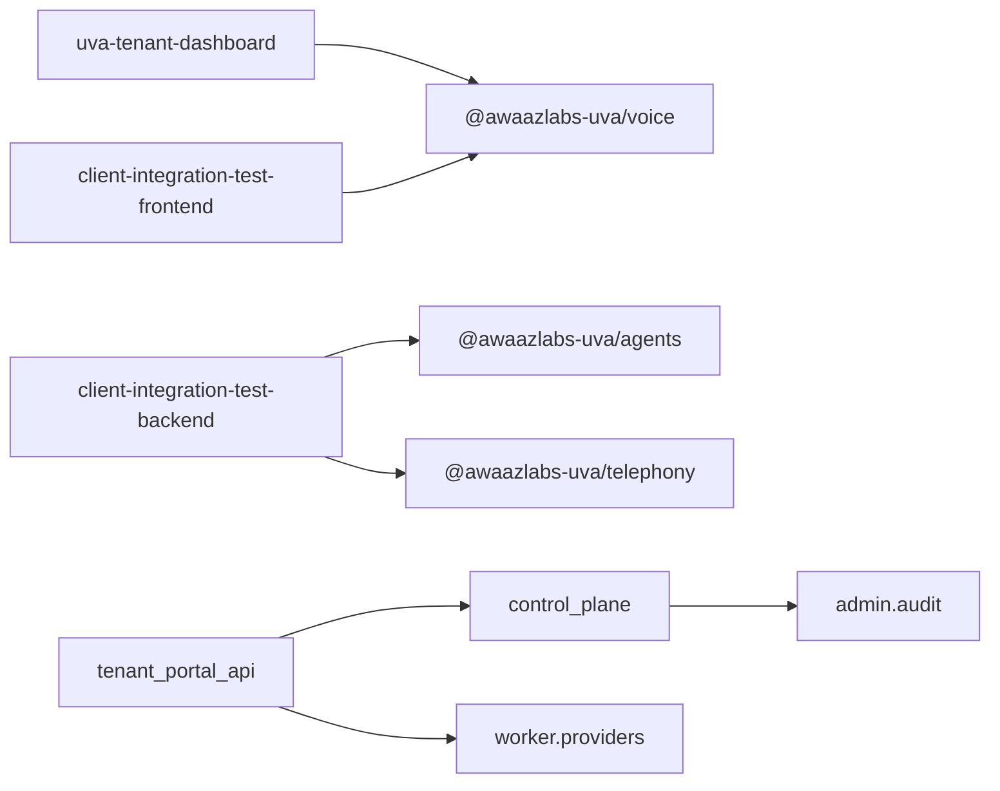

# Audit context (consolidated)

Detail packs: [01-structural-map.md](./01-structural-map.md) · [02-lifecycle-concurrency-security.md](./02-lifecycle-concurrency-security.md) · [03-integration-packaging-tests.md](./03-integration-packaging-tests.md) · [04-verification-log.md](./04-verification-log.md).

Graphify: not available (`graphify-out/` empty at verification — `audit-context/04-verification-log.md`).

---

## 1. Package table and dependency graph

### npm and services (corrected table from 01)

| name | version | path | purpose (code) | public? | entry | src LOC | tests |
|---|---|---|---|---|---|---|---|
| `@awaazlabs-uva/voice` | 1.1.0 | `sdk/` | Browser LiveKit client + session HTTP | public | `dist/index.js` | 921 / 4 files | 4 vitest files |
| `@awaazlabs-uva/agents` | 0.1.0 | `sdk-server/` | HMAC client `/machine/agents` + numbers | public | `dist/index.js` | 313 / 1 file | 1 node test file |
| `@awaazlabs-uva/telephony` | 0.1.0 | `telephony/` | HMAC client `/machine/telephony/*` | public | `dist/index.js` | 886 / 7 files | 2 node test scripts |
| `uva-tenant-dashboard` | 1.0.0 | `dashboard/` | Next.js tenant console | private | Next scripts | 8802 / 73 files | 0 |
| `awaazlabs-uva-host-tools` | 1.0.0 | `host-tools/` | Express tool gateway demo | private | `node src/server.js` | 364 / 3 files | 1 |
| `client-integration-test*` | 1.0.0 | `client-integration-test/` | smoke meta + FE/BE | private | scripts | FE 1601, BE 924 | 0 |
| `host-backend-starter` | 1.0.0 | `client-deliverables-final/host-backend-starter/` | minimal session mint host | private | `node src/server.js` | 286 / 4 files | 0 |
| Python `control_plane` | (no py version file) | `control_plane/` | FastAPI session mint/refresh | service | uvicorn Docker | 2167 / 11 py | pytest elsewhere |
| Python `worker` | — | `worker/` | LiveKit agents worker | service | `python -m worker.main` | 10476 / 63 py | pytest elsewhere |
| Python `tenant_portal_api` | — | `tenant_portal_api/` | portal + machine + telephony | service | uvicorn Docker | 12272 / 31 py | 1 under package |
| Python `admin` | — | `admin/` | super-admin FastAPI | service | uvicorn :8001 | 1117 / 6 py | 0 |
| Python `services` | — | `services/` | `tts_cache` fixtures | library | none in Docker CMD | 63 / 2 py | 0 |

Citations: package metadata and LOC — `audit-context/01-structural-map.md:L26-L63`; voice purpose `sdk/src/index.ts:L240-L306`; agents `sdk-server/src/index.ts:L184-L212`; telephony `telephony/src/index.ts:L58-L80`.

### Tooling and CI facts

| Fact | Citation |
|---|---|
| Root `package.json` only `devDependencies.supabase`; no workspaces | `package.json:L1-L5` |
| Per-package `package-lock.json` under sdk, sdk-server, telephony, dashboard | `audit-context/01-structural-map.md:L11` |
| CI Node 20; Python 3.12 | `.github/workflows/ci.yml:L18-L21`, `L80-L83` |
| Published SDK packages have no inter-SDK npm dependencies | `sdk/package.json:L45-L47`; `sdk-server/package.json:L45`; `telephony/package.json:L45-L50` |

### Verified import / dependency edges

| Edge | Citation |
|---|---|
| dashboard → voice | `dashboard/package.json:L12-L13`; `dashboard/src/app/test-studio/page.tsx:L6` |
| CIT FE → voice | `client-integration-test/frontend/src/main.ts:L6` |
| CIT BE → agents / telephony (dynamic import) | `client-integration-test/backend/src/createApp.js:L68-L73`; `client-integration-test/backend/src/telephonyRoutes.js:L27-L32` |
| portal → control_plane, worker.providers | `tenant_portal_api/app.py:L53-L61`; `tenant_portal_api/provider_capabilities.py:L22` |
| control_plane → admin.audit | `control_plane/app.py:L58` |
| No npm cycle among `@awaazlabs-uva/*` | `audit-context/01-structural-map.md:L105-L107` |

---

## 2. Audit surface index

LOC = non-test source lines (PowerShell `Measure-Object -Line` at verification where noted; else 01 pack). Unit ≈ cohesive group ≤~1500 LOC where possible; single files may exceed.

| unit ID | package | path(s) | LOC | what it does | external services | state held | entry / exit | depends on (units) | depended on by | facts (02/03 pointer) |
|---|---|---|---|---|---|---|---|---|---|---|
| VOICE-CORE | `@awaazlabs-uva/voice` | `sdk/src/index.ts` + `internal/*` | 921 | connect/mint/refresh/LiveKit room/events | host session HTTP, LiveKit WebRTC | per-instance room, session, listener Maps, refresh timer | in: `connect`/`disconnect`; out: host POST, LK WS | — | DASH-TS, CIT-FE | concurrency: `02:L24-L32`; security: `02:L57-L67`; errors: `02:L46-L55`; integration: `03:L25-L45`; tests: `03:L131-L156` |
| AGENTS-CLI | `@awaazlabs-uva/agents` | `sdk-server/src/index.ts` | 313 | signed REST to portal machine API | tenant portal HTTP | ctor options only | methods → `/machine/*` | — | CIT-BE | concurrency: `02:L87-L90`; security: `02:L103-L113`; integration: `03:L160-L220`; tests: `03:L248-L272` |
| TEL-CLI | `@awaazlabs-uva/telephony` | `telephony/src/*.ts` | 886 | 28 frozen telephony machine ops | portal telephony HTTP | private ctor fields | `TelephonyClient.*` → `/machine/telephony/*` | — | CIT-BE | concurrency: `02:L131-L135`; security: `02:L148-L158`; integration: `03:L276-L363`; tests: `03:L348-L362` |
| DASH-LIB | `uva-tenant-dashboard` | `dashboard/src/lib/**` | ~990 | Supabase browser, portal JWT memory, API clients | Supabase auth, portal API, control plane (voices) | module singleton Supabase; memoryPortalToken; sessionStorage caches | imported by pages | VOICE-CORE (Test Studio) | DASH-UI | security: `02:L195-L206`; concurrency: `02:L179-L182`; none recorded observability |
| DASH-UI | `uva-tenant-dashboard` | `dashboard/src/components/**`, `dashboard/src/app/**` | ~5574 (2335+3239 partial) | App Router UI, credentials, test studio | via DASH-LIB | React/local UI state | HTTP/page routes | DASH-LIB, VOICE-CORE | — | security sample: `02:L197-L198`; full pages NOT READ `02:L212` |
| HOST-TOOLS | `host-tools` | `host-tools/src/*` | 364 | demo `/api/tools/*` for worker | none outbound | `appointments` Map, `idempotency` Map | Express `/healthz`, `/api/tools` | — | WORK-TOOLS | cleanup: `02:L223-L227`; security: `02:L245-L256`; concurrency: `02:L229-L233` |
| CIT-FE | `client-integration-test-frontend` | `frontend/src/main.ts` (+ panel) | 1601 | Vite demo UI | host session endpoint, voice SDK | module agent ref, transcript/debug arrays | browser load | VOICE-CORE | — | partial read `02:L297-L331` |
| CIT-BE | `client-integration-test-backend` | `backend/src/*` | 924 | mint proxy, agents/telephony demos | control plane, portal | `_capsCache`, `_pipelineAppliedByAgent` Map | Express routes | AGENTS-CLI, TEL-CLI, CP-MINT | — | Maps no delete `02:L341`; fetch no timeout `02:L347`, `04-verification-log.md` |
| HOST-START | `host-backend-starter` | `client-deliverables-final/host-backend-starter/src/*` | 286 | minimal mint/refresh proxy | control plane | none | `/api/voice/session` | CP-MINT | — | JSON 32kb `02:L386`; security `02:L400-L407` |
| CP-APP | `control_plane` | `control_plane/app.py` | 956 | FastAPI routes, rate limits, refresh cap, dispatch rollback | Postgres, LiveKit API, Sentry optional | in-memory `_hits` rate buckets | `POST /v1/session`, `/refresh`, health | ADMIN-AUDIT | portal imports, CIT-BE | concurrency: `02:L435-L441`; cleanup: `02:L428-L433`; security: `02:L454-L460` |
| CP-MINT | `control_plane` | `control_plane/mint.py`, `mint_db.py`, `secrets*.py` | ~650 | HMAC mint, nonce insert, quota | Postgres, LiveKit JWT | DB rows | called from CP-APP | — | CP-APP | nonce insert `control_plane/mint.py:L138-L145`; no in-module delete `02:L432`; purge script `scripts/purge_used_nonces.py:L56-L57` |
| CP-AUTH-GUARD | `control_plane` | `control_plane/login_guard.py` | 96 | login throttle helpers | Postgres `login_attempts` | DB | imported by ADMIN-APP not CP-APP | — | ADMIN-APP | not wired to CP `02:L441` |
| WORK-MAIN | `worker` | `worker/main.py` | 1631 | entrypoint, prewarm, `cli.run_app` | LiveKit agents runtime, plugins | process/job state | `python -m worker.main start` | WORK-PROV, WORK-TOOLS | — | idle processes `worker/main.py:L1622-L1628`; file extent `worker/main.py:L1-L1631`; concurrency `02:L485-L491` |
| WORK-PROV | `worker` | `worker/providers/**` | 1396 | STT/LLM/TTS registry + adapters | Deepgram, Gladia, Gemini, Groq, Cartesia, etc. | provider caches (NOT FULLY READ) | `registry.build()` | — | WORK-MAIN | registry `worker/providers/registry.py:L32-L80`; fish not in registry `02:L206` |
| WORK-TOOLS | `worker` | `worker/tools.py`, `ssrf_guard.py` | 566 | tool POSTs to customer gateway | customer HTTP | httpx client singleton | session tool calls | HOST-TOOLS (demo) | WORK-MAIN | SSRF `worker/ssrf_guard.py:L19-L34`; timeouts `worker/tools.py:L32-L33`; security `02:L511-L518` |
| WORK-SESS | `worker` | `worker/session_close.py`, `session_opening.py`, `recording_*`, `latency.py` | ~1200 | session lifecycle, latency, recording policy | LiveKit room metadata, Supabase storage | turn maps partial NOT READ | entrypoint hooks | WORK-MAIN | — | quota release `worker/session_close.py:L72-L86`; latency `02:L493-L498` |
| WORK-TEL | `worker` | `worker/telephony_runtime.py`, `telephony_tts.py` | ~293 | telephony turn profile | telco path via LK | NOT FULLY READ | telephony sessions | WORK-MAIN | — | preemptive off telephony `worker/latency.py:L73-L88` |
| PORTAL-APP | `tenant_portal_api` | `tenant_portal_api/app.py` | 1112 | portal + machine routes, agent limits | Postgres, Supabase | request-scoped | uvicorn app | CP-MINT (imports), WORK-PROV | DASH-LIB | MAX_PROMPT 24k `tenant_portal_api/app.py:L150-L161`; security partial `02:L563-L571` |
| PORTAL-MACH | `tenant_portal_api` | `machine_auth.py` | 150 | HMAC machine auth + rate buckets | Postgres `used_nonces` | `_hits` OrderedDict | `/machine/*` gate | CP-MINT constants | PORTAL-APP | 30/120 rate `tenant_portal_api/machine_auth.py:L37-L39`; nonce burn `L173-L179` |
| PORTAL-TEL-CORE | `tenant_portal_api` | `telephony_service.py` | 2478 | Telnyx/LiveKit orchestration | Telnyx API, LiveKit SIP | DB telephony rows | machine + internal calls | PORTAL-TEL-HTTP | PORTAL-APP | body NOT READ `02:L543`, `02:L578`; file extent `tenant_portal_api/telephony_service.py:L1-L2478` |
| PORTAL-TEL-HTTP | `tenant_portal_api` | `telephony_routes.py`, `telephony_webhooks.py`, `telnyx_client.py`, `livekit_sip.py` | ~2977 | REST + webhooks | Telnyx, LiveKit | webhook LRU 20k `telephony_webhooks.py:L40-L45` | `/webhooks/telephony/telnyx` | — | PORTAL-TEL-CORE | webhook 256KiB `02:L549`; Ed25519 `02:L554` |
| PORTAL-DATA | `tenant_portal_api` | `queries.py`, `telephony_queries.py`, `membership.py` | ~1761 | SQL helpers | Postgres | none | imported | — | PORTAL-APP | NOT READ bulk `02:L578` |
| ADMIN-APP | `admin` | `admin/app.py`, `auth.py`, `security.py`, `audit.py` | 1117 | admin login, tenant secret rotate | Postgres | none in-memory Map | `/admin/*` | CP-AUTH-GUARD | CP-APP (audit) | throttle `admin/app.py:L240-L276`; rotate secret once `admin/app.py:L383-L387` |
| SVC-TTS-CACHE | `services` | `services/tts_cache.py` | ~63 | fixture WAV cache for tests | filesystem fixtures | none | import `get/require` | — | tests | SAMPLE_RATE 22050 `services/tts_cache.py:L10-L12` |
| REPO-CI | repo | `.github/workflows/*`, `Makefile` | — | build, test, publish, reconcile | GitHub Actions, npm, Docker | — | workflow triggers | all packages | — | sdk CI `03:L382-L396`; purge nonces `reconcile.yml:L110-L112` |

---

## 3. Cross-cutting facts

| Topic | Fact | Citation |
|---|---|---|
| Shared HMAC mint shape | `tenant_id.ts.nonce.agent_id` (CP) vs `tenant_id.ts.nonce.action.body_hash` (machine agents/telephony) | `control_plane/mint.py:L40-L44`; `sdk-server/src/index.ts:L246-L250`; `telephony/src/signing.ts:L45-L56` |
| Shared replay window constant | portal machine auth imports `REPLAY_WINDOW_SEC` from `control_plane.mint` | `tenant_portal_api/machine_auth.py:L34`; `control_plane/mint.py:L27-L28` |
| Shared `used_nonces` table | mint and machine auth insert `(tenant_id, nonce)` | `control_plane/mint.py:L141`; `tenant_portal_api/machine_auth.py:L175` |
| Nonce row deletion | not in mint module; batch script + reconcile workflow | `scripts/purge_used_nonces.py:L4-L17`, `L56-L57`; `.github/workflows/reconcile.yml:L110-L112` |
| Tenant secret providers | CP uses `DbSecretProvider` / `EnvSecretProvider` | `control_plane/app.py:L52-L53`; env `CP_TENANT_SECRETS` `control_plane/secrets.py:L46-L47` |
| Portal JWT | dashboard keeps portal token in module memory, not localStorage | `dashboard/src/lib/portalAuth.ts:L8-L15`, `L39-L47` |
| Session mint chain | browser → host (starter/CIT) → control plane → LiveKit token | `sdk/src/index.ts:L266-L306`; `client-deliverables-final/host-backend-starter/src/createApp.js:L84-L144`; `control_plane/app.py:L957` |
| Tool gateway contract | worker sends `x-tool-gateway-secret`; host-tools validates same env | `worker/tools.py:L164-L167`; `host-tools/src/createApp.js:L21-L28` |
| Provider selection | worker registry maps agent config to plugins; npm clients only pass string fields | `worker/providers/registry.py:L32-L80`; `sdk-server/src/index.ts:L198-L206` |
| Postgres URL | `SUPABASE_DB_URL` across CP, worker, portal, admin | `control_plane/app.py:L84`; `requirements.txt:L24-L25` |
| In-process rate limits | CP and portal machine/webhook limiters cap keys at 10_000; CP documents multi-worker multiplication | `control_plane/app.py:L406-L409`, `L411-L434`; `tenant_portal_api/machine_auth.py:L40-L44` |
| Per-process refresh ceiling | CP `MAX_REFRESHES = 720` (~24h at 120s TTL) | `control_plane/app.py:L479-L481` |

---

## 4. Documented vs actual (README / in-app docs vs code)

| Observation | Citation |
|---|---|
| Voice README constructor omits `sessionHeaders`, `sessionCredentials`; code accepts them | `sdk/README.md:L66-L69`; `sdk/src/index.ts:L33-L42` |
| Voice README read-only props omit `connectTiming`; getter exists | `sdk/README.md:L80-L82`; `sdk/src/index.ts:L224-L227` |
| `ConnectOptions.voiceId` typed but not sent on mint POST | `sdk/src/index.ts:L52-L55`, `L275-L278` |
| Voice README links `HOST_BACKEND_CONTRACT.md`; file marked superseded | `sdk/README.md:L21`, `L123`; `docs/HOST_BACKEND_CONTRACT.md:L1-L12` |
| Telephony README/CHANGELOG claim npm provenance; release workflow publishes without `--provenance` (comment: private repo) | `telephony/README.md:L23`; `telephony/CHANGELOG.md:L31-L32`; `.github/workflows/release-sdk.yml:L155-L156` |
| Dashboard lifecycle doc order vs SDK emits `connect_timing` before `connected` | `dashboard/src/content/docs/pages/events-and-lifecycle.ts:L11-L13`; `sdk/src/index.ts:L328-L331` |
| Agents README shows `process.env` wiring; npm package has no env reads | `sdk-server/README.md:L25-L28`; NOT FOUND `process.env` in `sdk-server/src` (`03:L174`) |
| Telephony README documents host env names; package source has no env reads | `telephony/README.md:L27-L34`; NOT FOUND in `telephony/src` (`03:L289`) |

---

## 5. Open questions (not determined from code alone)

| Question | Why open | Code touchpoint |
|---|---|---|
| Production worker replica count and load balancer affinity | CP rate limiter is per-process | `control_plane/app.py:L406-L407` |
| Whether `purge_used_nonces.py` runs on schedule in every deployment | Workflow exists; external cron not defined here | `.github/workflows/reconcile.yml:L110-L112` |
| Tenant model for host-tools demo (`tenant_id` in body vs secret) | Body tenant not cryptographically bound to secret | `host-tools/src/createApp.js:L81`, `L225` |
| Full telephony call state machine and idempotency in DB | `telephony_service.py` not read in pack | `tenant_portal_api/telephony_service.py:L1-L2478`; `02:L543` |
| Credential encryption and tools URL SSRF at portal save-time | modules not read | `tenant_portal_api/telephony_credentials.py`; `tenant_portal_api/tools_webhook.py` |
| Expected max concurrent sessions per tenant in production | quota logic in mint/DB not fully traced in pack | `control_plane/mint.py:L3-L7` |
| Legal env vars in dashboard | `.env.example` lists `NEXT_PUBLIC_LEGAL_*`; no reads under `dashboard/src` | `dashboard/.env.example:L18-L20`; `audit-context/01-structural-map.md:L315` |
| Deployment topology (Render vs local vs other) | `UVA_ENV` / `RENDER` used for hosted detection only | `admin/app.py:L65-L70`; `worker/recording_policy.py:L40` |

---

## 6. External services map (abbreviated)

Full table: `audit-context/01-structural-map.md:L187-L215`.

| Service | Primary consumers | Citation |
|---|---|---|
| LiveKit (WebRTC + API + agents + SIP) | voice SDK, CP, worker, portal | `sdk/package.json:L45-L47`; `control_plane/mint.py:L206-L217`; `worker/main.py:L1612-L1628`; `tenant_portal_api/livekit_sip.py:L27-L59` |
| Telnyx REST + webhooks | portal | `tenant_portal_api/telnyx_client.py:L24`; `tenant_portal_api/telephony_webhooks.py:L363-L369` |
| Postgres (Supabase) | CP, worker, portal, admin | `control_plane/app.py:L84`; `requirements.txt:L24-L25` |
| Supabase Auth/Storage (JS + service role) | dashboard, portal, worker recordings | `dashboard/src/lib/supabaseBrowser.ts:L10-L26`; `tenant_portal_api/supabase_admin.py:L17-L24`; `worker/session_recording.py:L29-L30` |
| STT/LLM/TTS vendors | worker plugins | `worker/providers/registry.py:L32-L80`; `.env.example:L13-L21` |
| Sentry | control_plane optional | `control_plane/app.py:L130-L137` |

---

## 7. Published npm public API (index)

Full symbol tables: `audit-context/01-structural-map.md:L117-L184`.

| Package | Classes / clients | Notable exports |
|---|---|---|
| voice | `AwaazLabsUvaVoice` | events, errors, `listVoices` — `sdk/src/index.ts:L151-L744` |
| agents | `AwaazLabsUvaAgentsClient` | CRUD agents, capabilities, numbers — `sdk-server/src/index.ts:L184-L311` |
| telephony | `TelephonyClient` | signing helpers + `TELEPHONY_MACHINE_OPERATIONS` — `telephony/src/index.ts:L45-L253` |

Deep import bypass documented: Vite `require('@awaazlabs-uva/voice/package.json')` — `client-integration-test/frontend/vite.config.ts:L8`; exports only `"."` — `sdk/package.json:L27-L33`.

---

## 8. Test and CI surface (abbreviated)

| Scope | What runs | Citation |
|---|---|---|
| Voice SDK | vitest 4 files; no full `connect()` integration test | `sdk/package.json:L42`; `03:L131-L156` |
| Agents SDK | 12 `node --test` cases; gaps on capabilities/numbers list-assign | `sdk-server/package.json:L42`; `03:L267-L271` |
| Telephony SDK | phase8 + phase9 contract tests for 28 ops | `telephony/package.json:L42`; `03:L348-L362` |
| CI | pytest unit/integration; npm ci build/lint/test×3; dashboard build; security-scan; docker-smoke | `.github/workflows/ci.yml:L11-L226`; `03:L382-L396` |
| Makefile `test` | pytest only (not npm) | `Makefile:L9-L10` |

Load/soak/concurrency dedicated suites: NOT FOUND under published npm test trees — `03:L139`, `L256`, `L357`.
