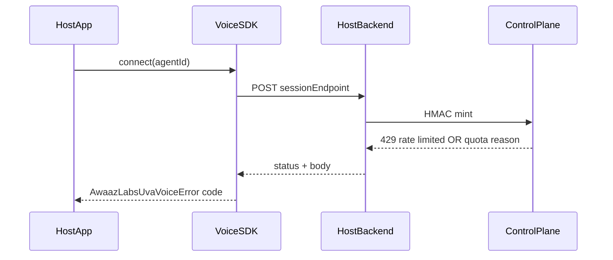

# SDK Wave 1 — F-H12 / F-M14 / F-M16 / F-L7 / F-L8 Implementation Plan

**Owner:** Habiba  
**Wave:** 1 (browser SDK connect hardening only)  
**Source of truth:** `docs/UVA-PRIORITY-LIST.md` · audit `docs/AwaazLabs UVA Audit.md` (§3.4, §9)  
**Code under change:** `sdk/src/` only (plus new tests under `sdk/`)

Use this doc to start a fresh implementation chat/agent. Do not expand scope beyond the five findings below.

---

## Scope (hard stop)

**In scope (this plan only):**

- [F-H12](UVA-PRIORITY-LIST.md) — single failed refresh kills the call (`sdk/src/index.ts` ~411–441)
- [F-M14](UVA-PRIORITY-LIST.md) — no fetch timeout (`:121`, `:181`, `:415`)
- [F-M16](UVA-PRIORITY-LIST.md) — three error codes; all 429s → `quota_exceeded` (`:46`, `:189–190`)
- [F-L7](UVA-PRIORITY-LIST.md) — `document.body` with no SSR guard (`:366`)
- [F-L8](UVA-PRIORITY-LIST.md) — throwing listener stops later listeners (`:274–278`)

**Out of scope (do not implement in this work):** F-H9, F-M2, humanization/TTFT, cold start, F-L6, browser SDK “add test script” as Habiba’s job, control-plane F-H7, npm publish (F-M21/F-L14/F-M23), README dead links (F-H2).

**Primary source docs for the implementer:**

- Priority roster + freeze: `docs/UVA-PRIORITY-LIST.md` lines 29–55, catalog entries F-H12 / F-M14 / F-M16 / F-L7 / F-L8
- Audit write-ups: `docs/AwaazLabs UVA Audit.md` §3.4 and §9 for those IDs
- Code under change: `sdk/src/index.ts` only (plus new test file under `sdk/`)

---

## Ehsan coordination (read before coding)

| Path / concern | Owner Wave 1 | Rule for this PR |
|---|---|---|
| `sdk/src/**` | **Habiba** | All behaviour fixes live here |
| `sdk/package.json` | **Ehsan** | Do **not** edit. No `"test"` script, no vitest dep in this PR |
| `sdk/README.md` | **Ehsan** | Do **not** edit. New error codes go in JSDoc on the type; Ehsan documents in his F-H2/publish PR |
| `control_plane/**` | **Ehsan** (dispatch only in Wave 1) | Do **not** change mint/refresh responses. F-H7 (refresh re-checks quota) is Wave 2 — not this PR. F-H12 is **client** retry only (priority note on F-H7) |
| `.github/`, `sdk-server/` | **Ehsan** | Do not touch |

**F-M16 without control-plane edits (locked approach):** Expand SDK error codes. Map using HTTP status **plus** response body text the control plane **already** emits when the host forwards it:

- CP `POST /v1/session` rate limit → body `{"error":"rate limited"}` (`control_plane/app.py` ~544–546)
- CP mint caps → `MintError` reasons `"concurrent cap reached"` / `"monthly minutes cap reached"` (`control_plane/mint.py` ~128–130) returned as `{"error": "<reason>"}` (~572–574)
- Client AbortController → `timeout`
- Host may send `error` / `detail` / `code` strings for `worker_not_ready` / `provider_limit` — map when present; otherwise keep `session_failed`

Browser SDK talks to the **host** `sessionEndpoint`, not CP directly. Mapping must tolerate both FastAPI `{detail}` and host `{error}` shapes.



---

## Current defects (verified in code)

File: `sdk/src/index.ts`

1. **F-L8** `emit` (~274–278): bare `for` loop; one throw aborts the rest.
2. **F-L7** `attachRemoteAudio` (~366): `document.body.appendChild` with no `typeof document` / `document.body` check.
3. **F-M16** (~46, ~189–190): only `'quota_exceeded' | 'agent_not_found' | 'session_failed'`; every `res.status === 429` → `quota_exceeded`.
4. **F-M14** (~121 `listVoices`, ~181 `connect`, ~415 `refreshToken`): raw `fetch`, no `AbortController`.
5. **F-H12** (~411–441): on refresh failure, emit `session_failed` once and **do not** reschedule; timer only set on connect success and successful refresh.

There are **zero** `*.test.ts` / `*.spec.ts` files in the repo today. `sdk/package.json` has `build` / `lint` only — no `test` (matches priority: Habiba writes tests; Ehsan wires script later).

---

## Locked design decisions

1. **Touched files:** `sdk/src/**` (implementation + `*.test.ts`), plus `sdk/tsconfig.json` (exclude tests from `tsc`) and optional `sdk/vitest.config.ts`. Pure helpers in `sdk/src/internal/http.ts` and `sdk/src/internal/errors.ts`. Do **not** touch `sdk/package.json` / `sdk/README.md` (Ehsan).
2. **New error codes** (extend `AwaazLabsUvaVoiceErrorCode`): keep existing three; add `rate_limit`, `timeout`, `token_refresh_failed`, `worker_not_ready`, `provider_limit` (audit F-M16 + F-H12 “distinct code” + F-M14 timeout).
3. **Default fetch timeout:** `15_000` ms; override via optional `fetchTimeoutMs?: number` on `AwaazLabsUvaVoiceOptions`.
4. **F-H12 retry:** exponential backoff (start ~1s, cap ~8s) while `Date.now() < tokenDeadline`. On connect / successful refresh, set `private sessionReceivedAt = Date.now()`. Deadline = `sessionReceivedAt + (expiresIn ?? 120) * 1000`. Non-terminal failures: do **not** emit terminal `error` each attempt (silent retry to avoid host teardown). On deadline / permanent 401: emit `token_refresh_failed` once; do not reschedule.
5. **Permanent vs transient refresh failure:** HTTP 401 / 403 → stop immediately with `token_refresh_failed`. Network / 5xx / timeout / other → retry until deadline.
6. **Unknown 429 body:** empty/unknown 429 body → still `quota_exceeded` (backward compatible); known rate-limit string → `rate_limit`; known quota strings → `quota_exceeded`.
7. **Tests:** write vitest-style unit tests with mocked `fetch` / fake timers; **Human + Ehsan** must add vitest + `"test"` to `sdk/package.json` before CI runs them. Until then Habiba verifies with `npx vitest run` locally (human OK).
8. **Public package surface:** export nothing new from package `exports` (Ehsan owns `package.json`). Internals are imported in tests via relative paths only.

---

## Phase 0 — Branch, freeze checklist, human gates

### Phase 0 status — COMPLETE (2026-09-15)

Locked by Habiba (human answers + repo setup):

| Decision | Locked value |
|---|---|
| Work branch | Existing **`habiba`** (do not rename/delete; do not use `habiba/...` nested name) |
| Code base | **`staging` merged into `habiba`** — HEAD now matches staging tip `b5260c74` |
| Push / PR workflow | Push work to **`habiba`**; when this SDK package is done, open **PR into `staging`** (staging is deployed) |
| Ehsan mid-edit on `sdk/package.json` / release? | **No** — Ehsan is not working right now |
| Host forwards CP 429 body strings? | **Unknown / check later** (Habiba). Coding uses plan default: empty/unknown 429 body → keep `quota_exceeded`; map `rate_limit` / quota only when body text is present |
| Nested branch `habiba/sdk-wave1-connect-hardening` | **Abandoned** — Git blocks it while branch `habiba` exists |

### 0.1 Sub-phase: Branch — done

- Checked out existing `habiba`.
- Merged local `staging` into `habiba` (fast-forward to `b5260c74`).
- Left remote `origin/habiba` for Habiba to push when ready (Phase 0 did **not** push).

### 0.2 Sub-phase: Freeze checklist (implementer self-check)

- Will not edit: `sdk/package.json`, `sdk/README.md`, `control_plane/`, `.github/`, `worker/`, `sdk-server/`.
- Will not implement F-L6 (latency to browser), F-H9, TTFT, cold start.

### 0.3 Human gates — answered

- Ehsan not mid-edit: confirmed.
- Host 429 body forwarding: deferred to Phase 3/7 verification (`don't know / check later`).

**Verification Phase 0:** On `habiba` @ staging tip; freeze rules recorded; no Phase 1 code yet.

---

## Phase 1 — F-L8: Safe `emit`

### 1.1 Change

In `emit` (~274–278): wrap each listener in `try/catch`. On throw: continue to remaining listeners; do not rethrow (listener bugs must not break the SDK bus). Prefer one `console.error` for debuggability.

### 1.2 Tests

- Register two listeners on `error` (or `connected`); first throws; second must still run (assert call count / flag).

### 1.3 Verification

- Unit test green.
- Manual: in browser console, `agent.on('connected', () => { throw new Error('boom') }); agent.on('connected', () => console.log('second ok'));` then connect — second logs.

**Refs:** Audit §3.4 bullet on `emit`; priority F-L8; code `emit`.

---

## Phase 2 — F-L7: SSR / missing-document guard

### 2.1 Change

In `attachRemoteAudio` before `document.body.appendChild`:

- If `typeof document === 'undefined'` or `!document.body`, skip DOM attach. Must **not** throw.
- Do not call `document` at module top level.

Note: audit says “throws if imported at module scope”; current throw is on attach path. Guard still closes the Next SSR / non-DOM failure mode when tracks subscribe or attach runs.

### 2.2 Tests

- Call attach path under mocked global without `document` — must not throw.
- With fake `document.body`, element is appended.

### 2.3 Verification

- Unit tests.
- Manual / Next: import `@awaazlabs-uva/voice` from a Server Component or `getServerSideProps`-style module — import alone must not throw; connecting only in client component.

**Human intervention:** If dashboard/test-studio is used for SSR check, that is Wave-1-frozen `dashboard/` — use a minimal local Next repro or node script deleting `global.document`, not a dashboard edit.

**Refs:** Audit §3.4 / F-L7; priority F-L7; code ~361–373.

---

## Phase 3 — F-M16: Error code surface + 429 mapping

### 3.1 Change

1. Extend `AwaazLabsUvaVoiceErrorCode` with: `rate_limit`, `timeout`, `token_refresh_failed`, `worker_not_ready`, `provider_limit`.
2. Add helper e.g. `mapSessionHttpError(status: number, bodyText: string): AwaazLabsUvaVoiceError` that:
   - Reads JSON `error` | `detail` | `code` (string or nested).
   - `429` + rate-limit-ish text (`rate limited`, `rate_limit`) → `rate_limit`
   - `429` + quota-ish text (`concurrent cap`, `monthly minutes`, `quota`) → `quota_exceeded`
   - Explicit `worker_not_ready` / `provider_limit` (any status or 429) → matching code
   - `404` → `agent_not_found` (unchanged)
   - Else non-OK → `session_failed`
3. In `connect` (~189–196): replace bare `if (res.status === 429) throw quota_exceeded` with helper using `await res.text()` (then parse).
4. JSDoc on the type listing each code’s meaning (substitute for README until Ehsan updates it).

### 3.2 Tests

- Table-driven: status/body → expected code for rate limit, concurrent cap, monthly minutes, empty/unknown 429 → `quota_exceeded`.

### 3.3 Verification

- Unit table tests.
- Manual: force host to return 429 `{"error":"rate limited"}` vs `{"error":"concurrent cap reached"}` and assert `error.code` in host app handler.

**Human intervention:** Host-backend engineer (may be same as Habiba on demo app, or Ehsan) confirms demo host forwards CP error strings. No `control_plane` PR in this phase.

**Refs:** Audit §3.4 / F-M16 fix text; priority F-M16; CP bodies in `app.py` / `mint.py`.

---

## Phase 4 — F-M14: AbortController on all three fetches

### 4.1 Change

1. Add `fetchTimeoutMs?: number` to options; default `15_000`.
2. Private / internal `fetchWithTimeout(url, init)` using `AbortController` + `setTimeout` abort; clear timer in `finally`.
3. On abort: throw `AwaazLabsUvaVoiceError('timeout', ...)`.
4. Wire into:
   - `listVoices` (~121)
   - `connect` session POST (~181)
   - `refreshToken` (~415)

### 4.2 Tests

- Mock `fetch` that never resolves; fake timers advance past timeout → `timeout` code.
- Completing fetch before timeout → success path unchanged.

### 4.3 Verification

- Unit tests with fake timers.
- Manual: point `sessionEndpoint` at a blackhole / `httpbin` delay > 15s → `connect()` rejects with `timeout` within ~15s (not hang forever).

**Refs:** Audit F-M14 “Add AbortController… distinct timeout error code”; priority F-M14 WHERE lines.

---

## Phase 5 — F-H12: Refresh retry until expiry

### 5.1 Change

Rewrite `refreshToken` (~411–441):

1. On connect / successful refresh, set `private sessionReceivedAt = Date.now()`.
2. Deadline for retries = `sessionReceivedAt + (expiresIn ?? 120) * 1000`.
3. Loop: attempt refresh with `fetchWithTimeout`; on success → `updateToken` if present → `scheduleTokenRefresh` → return.
4. On transient failure: wait backoff (1s, 2s, 4s, … cap 8s) if `Date.now() + delay < deadline`; else break.
5. On 401/403: break immediately.
6. After loop fails: `emit('error', new AwaazLabsUvaVoiceError('token_refresh_failed', ...))` — **do not** call `scheduleTokenRefresh`.
7. Ensure `disconnect` / `RoomEvent.Disconnected` still `clearRefreshTimer` (already does).

Do **not** change control-plane refresh auth (Ehsan / F-H7 Wave 2).

### 5.2 Tests

- First refresh fetch fails once, second succeeds → timer rescheduled; no terminal error.
- All attempts fail until past deadline → exactly one `token_refresh_failed`.
- 401 on first attempt → terminal immediately, no long backoff.

### 5.3 Verification

- Unit tests with mocked fetch + fake timers.
- Manual (human): connect a real call; block refresh URL in DevTools briefly then restore — call should survive; leave blocked until past TTL — one terminal error, call ends when LiveKit token expires.

**Human intervention:** Live browser call against staging (needs working LiveKit + host mint). Ehsan’s Groq/Cartesia account check is **not** required for this SDK-only PR, but needed for full Wave 1 demo later.

**Refs:** Audit F-H12 fix: “Retry with exponential backoff until the token's actual expiry… distinct, documented error code”; priority F-H12; F-H7 note (client vs server).

---

## Phase 6 — Automated test package (Habiba writes; Ehsan wires)

### 6.1 Habiba delivers

- Behaviour tests covering Phases 1–5.
- **Locked:** put pure helpers in `sdk/src/internal/http.ts` and `sdk/src/internal/errors.ts`, use them from `index.ts`, unit-test internals via relative imports. Do **not** change package `exports` / `package.json`.

### 6.2 Human + Ehsan gate (required before “CI green for SDK tests”)

Ehsan (separate PR or follow-up on his Wave 1 package work):

- Add `vitest` devDependency + `"test": "vitest run"` to `sdk/package.json`
- Optionally wire into CI later (his F-H2 scope — do not expand Habiba PR)

### 6.3 Verification

- Habiba local: `cd sdk && npx vitest run` (human OK without package.json script).
- After Ehsan wires: `npm test` in `sdk/`.
- Habiba still runs `npm run lint` / `npm run build` in `sdk/` (existing scripts).

---

## Phase 7 — End-to-end verification matrix + PR handoff

| ID | Automated | Manual |
|---|---|---|
| F-L8 | listener isolation test | console throw + second listener |
| F-L7 | no-document attach | Next/node import without document |
| F-M16 | table of status/body → code | host returns rate vs quota 429 |
| F-M14 | abort timeout test | hung endpoint rejects ~15s |
| F-H12 | retry success + deadline fail | DevTools block refresh |

### Phase 7 Habiba status (automated only — 2026-09-15)

| ID | Automated result | Manual |
|---|---|---|
| F-L8 | PASS (`sdk/src/index.test.ts`) | **BLOCKED — needs Habiba browser/console smoke** |
| F-L7 | PASS (`sdk/src/index.test.ts`) | **BLOCKED — needs Habiba Next/node import smoke** |
| F-M16 | PASS (`sdk/src/internal/errors.test.ts`) | **BLOCKED — needs host rate vs quota 429 E2E** |
| F-M14 | PASS (`sdk/src/internal/http.test.ts`) | **BLOCKED — needs hung-endpoint ~15s smoke** |
| F-H12 | PASS (`sdk/src/index.test.ts`) | **BLOCKED — needs DevTools refresh-block smoke** |

Also run (sdk/): `npm run lint` PASS · `npm run build` PASS · `npx vitest run` **20/20 PASS**.

`sdk/package.json` / `sdk/README.md` **not** modified (Ehsan exclusive).

### PR description draft (Habiba → `staging`, after commit + push)

```text
## Summary
- Closes audit findings F-H12, F-M14, F-M16, F-L7, F-L8 in the browser voice SDK.
- Safe per-listener `emit` (F-L8); SSR-safe `attachRemoteAudio` (F-L7).
- Distinct session error codes + body mapping (F-M16); AbortController fetch timeout (F-M14).
- Token refresh retries with backoff until expiry; terminal `token_refresh_failed` (F-H12).
- Pure helpers under `sdk/src/internal/`; unit tests under `sdk/src/**/*.test.ts`.

## Files
- `sdk/src/**` (implementation + tests)
- `sdk/tsconfig.json` (exclude `*.test.ts` so lint/build stay clean)
- `sdk/vitest.config.ts` (local runner; no package.json `test` script yet)

## Ehsan follow-ups
1. Add `vitest` devDependency + `"test": "vitest run"` to `sdk/package.json`.
2. Document new error codes in `sdk/README.md`.
3. Coordinate with release-sdk / metadata PRs — do not conflict.

## Explicitly not done
- Control-plane refresh quota re-check (F-H7).
- Other Habiba Wave 1 items (humanization/TTFT, F-H9, F-M2 worker, cold start, etc.).
- Manual staging smoke (connect / refresh / timeout / host 429 body) — Habiba sign-off pending.
```

### Final human sign-off

- Habiba: manual connect + refresh + timeout smoke on staging host.
- Ehsan: ACK that package.json/README follow-up is on his list before publish (F-M21).

---

## Implementation order (strict)

```text
Phase 0 (human freeze)
  → Phase 1 F-L8
  → Phase 2 F-L7
  → Phase 3 F-M16 (codes + mapper)
  → Phase 4 F-M14 (timeouts use `timeout` code)
  → Phase 5 F-H12 (retry + `token_refresh_failed`)
  → Phase 6 tests
  → Phase 7 verification + Ehsan handoff
```

Do not start F-H9 / TTFT / cold start in the same PR.

---

## Checklist for implementer agent

- [x] Phase 0 freeze ACK + branch (`habiba` @ staging tip `b5260c74`; host 429 deferred)
- [x] Phase 1 F-L8 (`emit` try/catch per listener; automated unit test deferred to Phase 6 — no vitest in `sdk/package.json`)
- [x] Phase 2 F-L7 (`attachRemoteAudio` guards `document` / `document.body` before appendChild)
- [x] Phase 3 F-M16 (error codes + `mapSessionHttpError` on connect; host 429 body E2E still check-later)
- [x] Phase 4 F-M14 (`fetchWithTimeout` / AbortController on listVoices, connect, refresh; default 15s)
- [x] Phase 5 F-H12 (refresh retry with backoff until token expiry; terminal `token_refresh_failed`)
- [x] Phase 6 tests under `sdk/src/`
- [x] `npm run lint` / `npm run build` in `sdk/`
- [x] Phase 7 automated matrix + PR notes for Ehsan (manual smoke + commit/push/PR = human gate)
- [ ] Manual Phase 7 matrix (Habiba staging smoke)
- [ ] Commit + push `habiba` + PR → `staging` (human ACK)
- [ ] `git diff --name-only` for the PR commit shows only `sdk/src/**` (+ `sdk/tsconfig.json`, `sdk/vitest.config.ts`; plan doc separate if committed)
