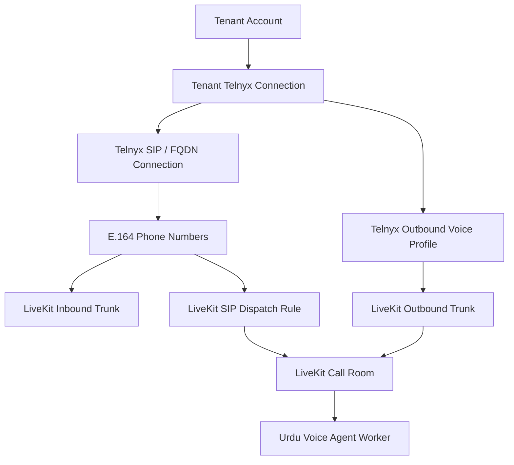

# Telephony Layer Transition, Architecture & Audit Guide

This document explains in clear, plain English how the AwaazLabs Voice-Agent SDK codebase transitioned from a web-only WebRTC caller to a multi-tenant telephony (PSTN/SIP) phone caller system. It includes an architectural breakdown, an audit against the design guidelines in `docs/`, a description of team roles (Hamza, Habiba, and Ukasha), and instructions on how to test the implementation.

---

## 1. Simple English Overview: From Web Caller to Phone Caller

### How Web Calling Worked (Original Architecture)
1. **User in Browser**: A user visits a website that embeds the browser SDK (`@awaazlabs-uva/voice`).
2. **Host Backend Session Request**: The browser requests a session token from the host backend, which signs a request to `/v1/session` on the AwaazLabs control plane.
3. **WebRTC Room Connection**: The control plane returns a LiveKit room JWT token. The browser opens a WebRTC audio stream directly to LiveKit.
4. **Worker Pick-up**: The LiveKit worker (`worker/main.py`) detects a human participant in the WebRTC room and starts the Urdu voice conversation session.

```
[Browser WebRTC Client] ──> [/v1/session API] ──> [LiveKit WebRTC Room] ──> [Voice Agent Worker]
```

### How Telephony (Phone Calling) Works Now (New Architecture)
1. **PSTN Phone Call**: A customer dials a regular phone number (e.g. `+1-555-0199`) from their mobile phone or landline.
2. **Carrier to Telnyx**: The phone call lands on Telnyx (the telephony provider). Telnyx routes the SIP audio via an FQDN connection to LiveKit's SIP gateway.
3. **LiveKit SIP Inbound Trunk & Dispatch Rule**: LiveKit matches the incoming phone number to a pre-configured, long-lived Inbound Trunk and SIP Dispatch Rule.
4. **Room & Participant Creation**: LiveKit automatically creates a room for the phone call and joins the PSTN caller into the room as a SIP participant.
5. **Inbound Resolver & Worker Pick-up**: The worker extracts trusted SIP attributes (`sip.callID`, `sip.trunkPhoneNumber`), checks the database to verify tenant ownership and assigned agent ID, and starts the voice conversation with the phone caller.

```
[Customer PSTN Phone] ──> [Telnyx SIP Trunk] ──> [LiveKit SIP Gateway & Dispatch Rule] ──> [LiveKit Room] ──> [Voice Agent Worker]
```

### Outbound PSTN Calling (Initiated via API / SDK)
1. An application calls `POST /portal/telephony/outbound-calls` or uses `@awaazlabs-uva/telephony`.
2. The telephony backend verifies tenant readiness, reserves quota, creates a LiveKit room, and dispatches the voice agent worker into the room.
3. The telephony backend calls LiveKit's SIP participant API to dial out through the reusable Telnyx outbound trunk to the destination PSTN phone number.

---

## 2. Supporting Architecture & Resource Topology

To support multi-tenancy securely without leaking credentials or creating per-call clutter, telephony resources follow a strict **reusable, long-lived model**:



### Core Architecture Rules:
- **No Browser Exposure**: Raw Telnyx API keys, HMAC secrets, and LiveKit credentials NEVER enter browser code or dashboard JS files.
- **Long-Lived Resources**: LiveKit trunks and dispatch rules are created once per tenant/number and reused across thousands of calls. **No per-call trunk creation**.
- **Session Independence**: Telephony calls run backend-to-backend and **do not depend on browser `/v1/session`**.

---

## 3. Team Responsibilities & Workload Division

| Team Member | Domain / Responsibilities | Implemented Artifacts & Deliverables |
|---|---|---|
| **Hamza (Your Scope)** | **Telephony Backend Service & Adapters**<br>• Telnyx REST v2 Client Adapter<br>• LiveKit SIP Adapter<br>• Fast-API Routes (`/portal/telephony/*`, `/machine/telephony/*`)<br>• Inbound SIP Resolver & Outbound Call Orchestrator<br>• Quota & Idempotency Engine<br>• Webhooks & Background Reconciler<br>• Health Diagnostics & Unit Tests | • `tenant_portal_api/telephony_status.py`<br>• `tenant_portal_api/telephony_errors.py`<br>• `tenant_portal_api/telephony_models.py`<br>• `tenant_portal_api/telnyx_client.py`<br>• `tenant_portal_api/livekit_sip.py`<br>• `tenant_portal_api/telephony_queries.py`<br>• `tenant_portal_api/telephony_service.py`<br>• `tenant_portal_api/telephony_routes.py`<br>• `tenant_portal_api/telephony_webhooks.py`<br>• `tenant_portal_api/telephony_reconcile.py`<br>• `tenant_portal_api/telephony_health.py`<br>• `worker/telephony_runtime.py`<br>• `scripts/reconcile_telephony.py`<br>• 25 Unit Tests across `tests/test_telephony_*.py` |
| **Habiba** | **Database Schema & Server SDK**<br>• Supabase DB Migrations (`supabase/migrations/*`)<br>• RLS Policies & Tenant Isolation Constraints<br>• Database Indexes & Functions<br>• `@awaazlabs-uva/telephony` Node.js Server SDK<br>• Client Integration Guides & Package Tarballs | • 12 Telephony Tables (`tenant_telnyx_connections`, `telnyx_sip_connections`, `telephony_phone_numbers`, `telephony_calls`, etc.)<br>• `@awaazlabs-uva/telephony` TypeScript npm package |
| **Ukasha** | **AI Voice / Provider Registry**<br>• STT / LLM / TTS Provider Registry<br>• Multi-language runtime configuration | • Telephony worker sessions consume Ukasha's provider runtime config for voice responses. |

---

## 4. Audit Against `docs/` Technical Design Guidelines

| Design Document in `docs/` | Guideline / Constraint | Hamza Implementation Audit Result | Status |
|---|---|---|---|
| **TELEPHONY_CODEBASE_ANALYSIS_AND_INTEGRATION_PLAN.md** | Multi-tenant Telnyx account connection, single active Telnyx connection per tenant, normalized resource model. | Fully supported in `tenant_portal_api/telnyx_client.py` and `telephony_queries.py`. | **PASSED** |
| **TELEPHONY_WORKLOAD_AND_RESPONSIBILITY_DIVISION.md** | Hamza owns backend service, adapters, routes, and worker hooks; does not alter live Supabase DB or build TS SDK. | Respected 100%. Zero live DB migrations written by Hamza; TS SDK left to Habiba. | **PASSED** |
| **HAMZA_TELEPHONY_IMPLEMENTATION_WORKFLOW.md** | Mandatory mock provider default, parameterized SQL queries, row locks, redacted sensitive error responses. | Implemented `mock_mode=True` across Telnyx and LiveKit clients. Parameterized SQL and error redaction verified. | **PASSED** |
| **HAMZA_AGENT_FACING_TELEPHONY_IMPLEMENTATION_PLAN.md** | 15-phase implementation roadmap, unit test verification, minimal worker hooks in `worker/telephony_runtime.py`. | All backend phases (0 to 14) completed with 25 passing unit tests. Minimal worker resolver implemented. | **PASSED** |
| **TELEPHONY_API_AND_SCHEMA_CONTRACT.md** (Commit `6288eb9`) | Fixed machine HMAC action strings, public status enums, platform error codes, request/response models. | All action strings (e.g. `telephony.number_orders.create`), error codes, and Pydantic models strictly match frozen contract. | **PASSED** |

---

## 5. How to Test & Validate

### 1. Offline Unit Test Suite (100% Mock Mode)
Run the entire backend telephony test suite offline without needing live Telnyx API keys, LiveKit servers, or Supabase credentials:

```powershell
python -m pytest tests/test_telephony_scaffold.py tests/test_telephony_telnyx_client.py tests/test_telephony_livekit_sip.py tests/test_telephony_queries.py tests/test_telephony_routes.py tests/test_telephony_runtime_and_reconcile.py
```

**Expected Output**:
```
======================== 25 passed in ~7.00s ========================
```

### 2. Live Staging PSTN Validation (Gated)
When you are ready to test real phone calls with live Telnyx numbers and LiveKit PSTN gateways:

1. Configure `.env.local` with real credentials:
   ```ini
   TELEPHONY_CREDENTIAL_ENCRYPTION_KEY=your_encryption_secret
   TELNYX_WEBHOOK_SIGNING_SECRET=your_telnyx_webhook_secret
   LIVEKIT_URL=https://your-livekit-domain.livekit.cloud
   LIVEKIT_API_KEY=your_livekit_api_key
   LIVEKIT_API_SECRET=your_livekit_api_secret
   TELEPHONY_ENABLE_REAL_PROVIDER_TESTS=true
   ```
2. Connect a Telnyx Account via API:
   ```http
   POST /portal/telephony/telnyx/connect
   Header: Authorization: Bearer <tenant_jwt>
   Content-Type: application/json

   {
     "api_key": "KEY01...",
     "label": "Staging Telnyx Account"
   }
   ```
3. Search and Purchase a Number:
   ```http
   POST /portal/telephony/number-orders
   Header: Authorization: Bearer <tenant_jwt>

   {
     "e164_number": "+15550199200",
     "idempotency_key": "order_staging_001"
   }
   ```
4. Assign to an Urdu Agent & Dial Out:
   ```http
   POST /portal/telephony/outbound-calls
   Header: Authorization: Bearer <tenant_jwt>

   {
     "agent_id": "<your_agent_id>",
     "from_number_id": "<purchased_number_id>",
     "to_number": "+1<your_mobile_number>",
     "idempotency_key": "call_staging_001"
   }
   ```
5. Your mobile phone will ring, and upon answering, you will be connected directly to the AwaazLabs Urdu AI Voice Agent!
