# Phase 4: Low Severity Alignments & End-to-End Smoke Matrix

## Executive Overview
Phase 4 handles remaining code/enum alignment issues (`TEL-LOW-01`) and defines the comprehensive End-to-End Regression & Soak Test Suite required for final production sign-off.

---

## Gap 4.1: Outbound Trunk Eligibility Enum Alignment (`TEL-LOW-01`)

### Problem Statement & Root Cause
- **Location**: [`tenant_portal_api/telephony_service.py`](file:///d:/FinovaSolution/habiba-sdk-agent/tenant_portal_api/telephony_service.py) (`_eligible_outbound_trunk_numbers`).
- **Anomaly**: `_eligible_outbound_trunk_numbers` filters phone numbers using `provisioning_status IN ('owned', 'active')`. However, `'active'` is not a valid enum value in `NumberProvisioningStatus` (the active state for phone numbers is designated as `'owned'`).
- **Impact**: Inclusion of undeclared status strings creates developer confusion and risks subtle query misbehavior.

### Detailed Architectural Fix Specification
1. **Query & Status Alignment**:
   In `tenant_portal_api/telephony_service.py` and `telephony_queries.py`:
   ```python
   # Replace legacy 'active' status check with canonical NumberProvisioningStatus.OWNED
   def _eligible_outbound_trunk_numbers(conn, tenant_id: str):
       return queries.get_numbers_by_status(
           conn,
           tenant_id=tenant_id,
           provisioning_status=NumberProvisioningStatus.OWNED.value,
           routing_status=NumberRoutingStatus.READY.value
       )
   ```

### Verification & Test Specifications
- **Test 4.1a (Trunk Eligibility Query Strictness)**:
  - Seed 3 phone numbers for a tenant:
    - Number A: `provisioning_status='owned'`, `routing_status='ready'`
    - Number B: `provisioning_status='disabled'`, `routing_status='disabled'`
    - Number C: `provisioning_status='purchase_pending'`, `routing_status='not_configured'`
  - Execute `_eligible_outbound_trunk_numbers()`.
  - **Assert**: Returns **only** Number A.

---

## End-to-End Regression & Concurrency Smoke Matrix

Before promoting changes to staging/production, the following consolidated test suite must pass cleanly without failures or resource leaks.

```mermaid
flowchart LR
    subgraph Phase1 [Phase 1 Gates]
        P1_1[Outbound Idempotency]
        P1_2[Purchase Race Lock]
        P1_3[Purchase Pending Progression]
    end

    subgraph Phase2 [Phase 2 Gates]
        P2_1[Status Mapping]
        P2_2[LiveKit Cleanup]
        P2_3[Worker Metadata Verification]
        P2_4[Disabled State Immunity]
        P2_5[Tenant Webhook Dedupe]
        P2_6[Active Call Guardrails]
    end

    subgraph Phase3 [Phase 3 Gates]
        P3_1[Bounded Webhook Replay]
        P3_2[Exponential Backoff]
        P3_3[Reconciler Completeness]
    end

    subgraph Phase4 [Phase 4 & Release]
        P4_1[Enum Alignment]
        P4_2[E2E Smoke Matrix]
        P4_3[Production Release Sign-off]
    end

    Phase1 --> Phase2 --> Phase3 --> Phase4
```



### E2E Test Suite Inventory

| Test Suite ID | Test Description | Success Criteria |
| :--- | :--- | :--- |
| `E2E-01` | **Concurrency Storm (Outbound Calls)** | 20 concurrent identical `create_outbound_call` requests result in exactly 1 LiveKit participant & 1 DB call record. |
| `E2E-02` | **Concurrency Storm (Purchase)** | 10 parallel identical `purchase_number` calls result in exactly 1 Telnyx order & 1 DB order record. |
| `E2E-03` | **Lifecycle Disable & Inbound Routing** | Disabling a number removes LiveKit dispatch rules; worker rejects enqueued job metadata for disabled number. |
| `E2E-04` | **Multi-Tenant Webhook Isolation** | Simultaneous identical webhook event IDs delivered to two different tenants process cleanly without collision. |
| `E2E-05` | **Destructive Action Safety** | Attempting to disable a number with 2 active calls throws HTTP 409; passing `force=True` drains and completes cleanly. |
| `E2E-06` | **Full Reconciler Sweep** | Background reconciler run advances pending purchases, releases leaked quotas, and prunes expired webhooks. |

---

## Acceptance Gates for Production Release

- [ ] **Gate A (Phase 1 Passed)**: Zero idempotency double-creation issues under multi-threaded soak tests. `purchase_pending` numbers successfully promote to `owned`.
- [ ] **Gate B (Phase 2 Passed)**: Zero orphaned LiveKit dispatch rules after disabling numbers. Worker revalidates all inbound job metadata against DB. Database migration `0014` applied.
- [ ] **Gate C (Phase 3 Passed)**: Transient HTTP 429/502 errors automatically recover via backoff. Reconciler handles stale orders and quota leaks. Memory footprint remains stable.
- [ ] **Gate D (Phase 4 Passed)**: All enum filters strict. Full E2E Smoke Matrix (`E2E-01` through `E2E-06`) executes with 100% pass rate.
